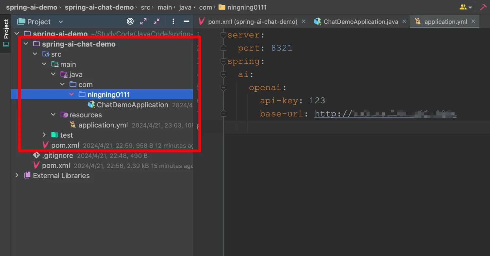
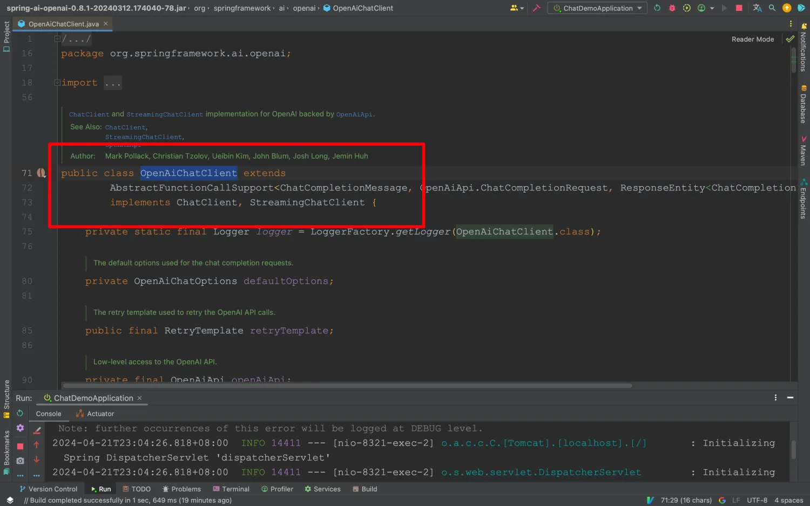
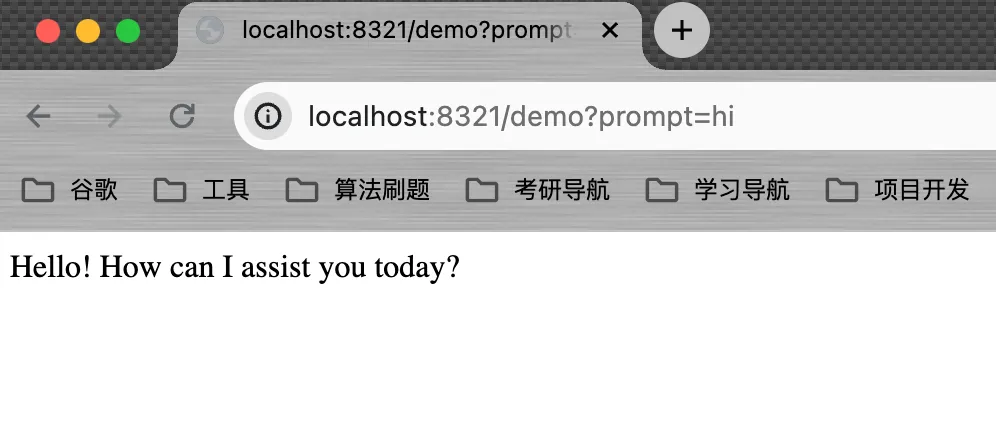
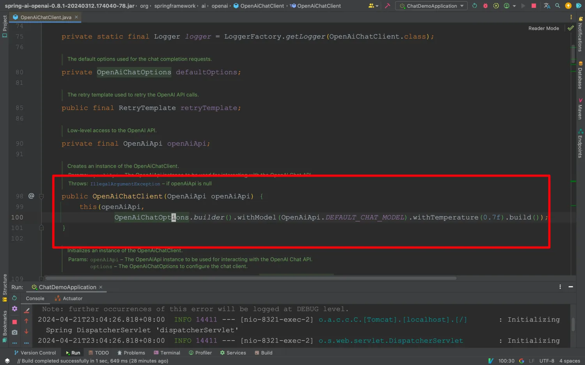
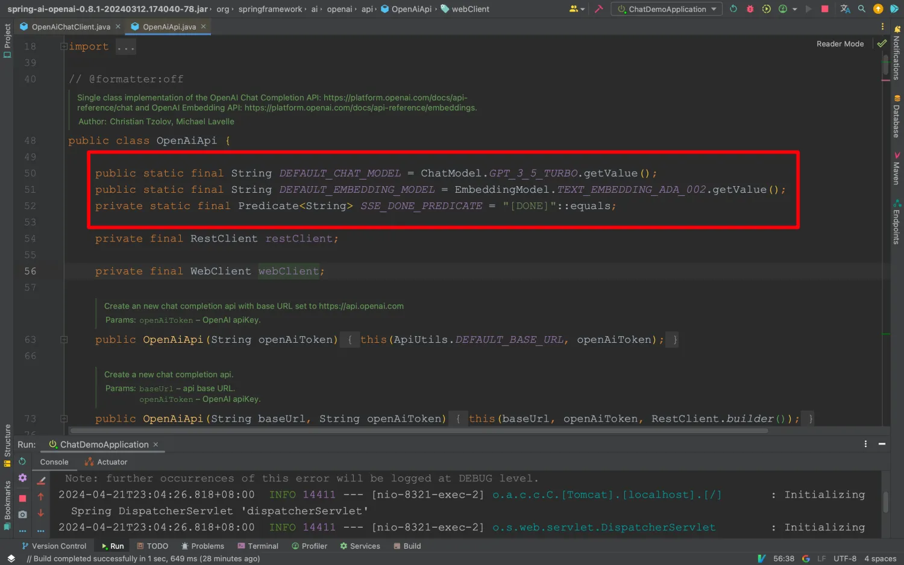

&emsp;聊天API允许我们通过简单的配置快速地调用大语言模型以对用户的输入文本进行回复响应。聊天API通常是我们向AI模型发起请求从而工作的，AI模型获得输入数据，根据预先训练好的数据进行文本生成再返回给我们，我们将得到的生成结果应用在我们的程序中，这就是一个完整的调用流程。

## 1.1 项目搭建

&emsp;创建子模块,并在`pom.xml`文件中引入下面的依赖。

```xml
<dependency>
    <groupId>org.springframework.ai</groupId>
    <artifactId>spring-ai-openai-spring-boot-starter</artifactId>
</dependency>
```

&emsp;上述依赖是用于请求OpenAI平台相关模型，例如：对话用的ChatGPT、画图用的Dall-e-2/3、文本嵌入text-embedding-ada-002以及音频合成与识别的whisper和tts等相关模型。
接着我们再创建配置文件`application.yml`，将相关key和api信息进行填写

```yaml
server:
  port: 8321
spring:
  ai:
    openai:
      api-key: 123
      base-url: 默认:https://api.openai.com

```



## 1.2 快速对话

&emsp;在我们配置完成后，当SpringBoot启动时，会为我们自动注入`OpenAiChatClient`的Bean，该Bean实现了对ChatGPT系列的阻塞式调用和流式调用的接口。



&emsp;在这里，我们选择阻塞式调用接口进行演示。
创建一个`ChatController`类，将`ChatClient`注入进来,并编写一个简单的接口进行测试：

```java
package com.ningning0111.controller;

import org.springframework.ai.chat.ChatClient;
import org.springframework.web.bind.annotation.GetMapping;
import org.springframework.web.bind.annotation.RestController;

@RestController
public class ChatController {

    private final ChatClient chatClient;

    public ChatController(ChatClient chatClient) {
        this.chatClient = chatClient;
    }

    @GetMapping("/demo")
    public String demo(String prompt){
        
        String response = chatClient.call(prompt);
        
        return response;
    }
}

```



在上面的测试接口中，核心代码`String response = chatClient.call(prompt)`。其中，`prompt`是我们输入到ChatGPT的文本（一般是问题）,`response`则是ChatGPT针对prompt生成出的文本，即响应。Spring AI将底层的请求、参数配置等进行了封装，AI模型默认`gpt-3.5-turbo`。因此我们只需这简简单单的一行代码就能对接ChatGPT。




