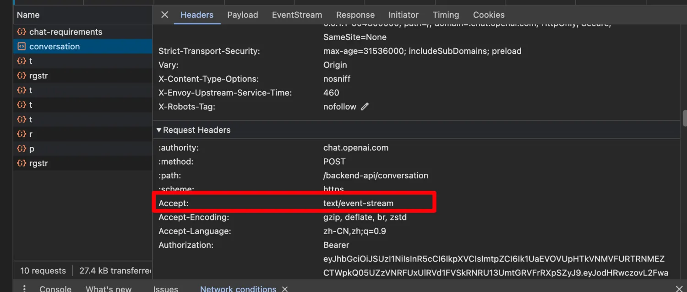
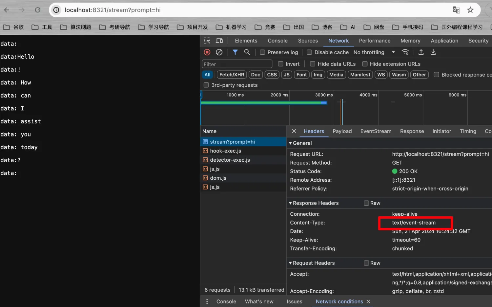

# 流式对话

&emsp;在**快速入门**那节中，演示了阻塞式的聊天调用，一般来说，由于网络请求或AI生成的文本过长等因素，会导致阻塞式的聊天调用对用户的体验非常不好。而目前对于对话式的应用场景，主流的调用方式基本采用的是流式对话。什么是流式对话？流失对话的核心就是**流式传输**，AI的响应数据是一点一点传过来的，不用等AI将文本全部生成出来了才传过来。一定程度上能够提高使用上的响应速度，给用户一个非常好的体验。
目前流式对话的实现手段主要有两种：`SSE`和`WebSocket`协议。SSE是基于Http实现的一种服务端向客户端推送消息的技术，WebSocket则是基于TCP协议实现的全双工通信技术。SSE的实现较为简单，而WebSocket较为复杂，且后者对资源的占用率很高。OpenAI官网采用的是SSE实现的。



&emsp;Spring AI中流式对话接口采用的是Spring WebFlux异步网络框架实现的，WebFlux底层默认采用Netty，因此，如果需要了解Spring AI流式对话底层的实现，则需要对异步网络编程有一定的了解。当然，这些并不妨碍我们进行简单的调用。

```java
package com.ningning0111.controller;

import org.springframework.ai.chat.ChatClient;
import org.springframework.ai.chat.StreamingChatClient;
import org.springframework.http.MediaType;
import org.springframework.web.bind.annotation.GetMapping;
import org.springframework.web.bind.annotation.RestController;
import reactor.core.publisher.Flux;

@RestController
public class ChatController {

    private final ChatClient chatClient;
    private final StreamingChatClient streamingChatClient;

    public ChatController(ChatClient chatClient, StreamingChatClient streamingChatClient) {
        this.chatClient = chatClient;
        this.streamingChatClient = streamingChatClient;
    }

    @GetMapping("/demo")
    public String demo(String prompt){
        String response = chatClient.call(prompt);
        return response;
    }

    // 流式调用 将produces声明为文本事件流
    @GetMapping(value = "/stream",produces = MediaType.TEXT_EVENT_STREAM_VALUE)
    public Flux<String> stream(String prompt){
        // 将流中的内容按顺序返回
        return streamingChatClient.stream(prompt).flatMapSequential(Flux::just);
    }

}

```


