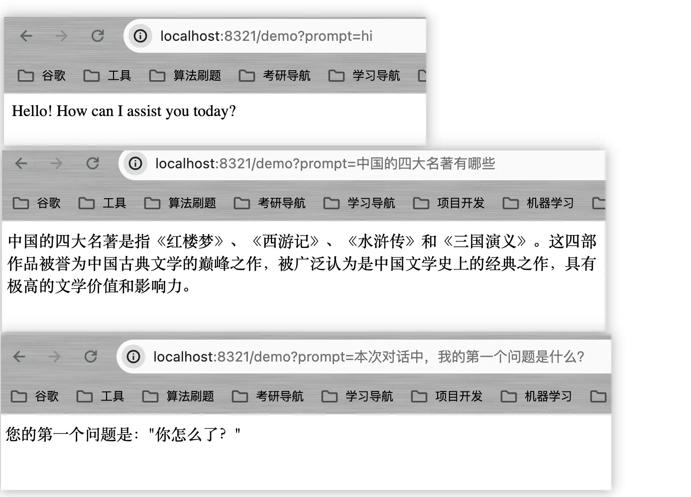

# 上下文对话

上下文对话的作用就是让AI具有记忆力，在**快速入门**和**流式对话**中，我们是通过一种单一的输入输出方式进行调用的，这种调用方式无法让AI具有记忆力，例如,当我发起如下问题时：

- hi
- 中国的四大名著有哪些？
- 本次对话中，我的第一个问题是什么？



&emsp;可以看到，AI无法根据之前的对话内容进行分析回复。因此，这就要求我们实现一个可以让ChatGPT具有一定的记忆力，并根据过去的聊天信息进行回复。
 ChatGPT上下文对话的实现原理较为简单，本质上其实就是**将不同角色的聊天信息依次存储在一个队列中发送给ChatGPT即可，然后ChatGPT会根据整个聊天信息对回复内容进行判断**。在OpenAI提供的接口中，每条信息的角色总共分为三类：

- SystemMessage：系统限制信息，这种信息在对话中的权重很大，AI会优先依据SystemMessage里的内容进行回复；
- UserMessage：用户信息
- AssistantMessage：AI回复信息
> 还有一个FunctionMessage,这类信息用于AI的函数调用，一般不予以讨论。


&emsp;这些Message均实现了一个`Message`接口，如上图。`AbstractMessage`提供了对`Message`接口的抽象实现,`SystemMessage`、`UserMessage`、`AssistantMessage`等均继承了`AbstractMessage`，是Message的具体实现。而`ChatMessage`是Message的扩展实现，用于创建其它大语言模型需要的Message。

> 通俗点讲就是有些AI的Message不支持这类System、User、Assistant等，这时，我们就可以通过ChatMessage去自定义创建可用的Message对象了。


&emsp;如果我们需要实现上下文对话，就只需要使用一个List存储这些Message对象，并将这些Message对象一并发送给AI，AI拿到这些Message后，会根据Message里的内容进行回复。
不过，根据OpenAI的计费规则，**你的消息队列越长，单次问询需要的费用就会越高**，因此我们需要对这个消息列表的长度进行限制。

```java
package com.ningning0111.controller;

import org.springframework.ai.chat.ChatClient;
import org.springframework.ai.chat.ChatResponse;
import org.springframework.ai.chat.messages.AssistantMessage;
import org.springframework.ai.chat.messages.Message;
import org.springframework.ai.chat.messages.UserMessage;
import org.springframework.ai.chat.prompt.Prompt;
import org.springframework.web.bind.annotation.GetMapping;
import org.springframework.web.bind.annotation.RestController;

import java.util.ArrayList;
import java.util.List;

@RestController
public class ChatController {

    private final ChatClient chatClient;

    // 历史消息列表
    static List<Message> historyMessage = new ArrayList<>();
    // 历史消息列表的最大长度
    static int maxLen = 10;

    public ChatController(ChatClient chatClient) {
        this.chatClient = chatClient;
    }

    @GetMapping("/context")
    public String context(String prompt) {
        // 用户输入的文本是UserMessage
        historyMessage.add(new UserMessage(prompt));
        // 发给AI前对历史消息对列的长度进行检查
        if(historyMessage.size() > maxLen){
            historyMessage = historyMessage.subList(historyMessage.size()-maxLen-1,historyMessage.size());
        }
        // 获取AssistantMessage
        ChatResponse chatResponse = chatClient.call(new Prompt(historyMessage));
        AssistantMessage assistantMessage = chatResponse.getResult().getOutput();
        // 将AI回复的消息放到历史消息列表中
        historyMessage.add(assistantMessage);
        return assistantMessage.getContent();
    }

}

```

效果如下：


&emsp;可以看到，我们已经成功让AI具有一定的记忆力了～
