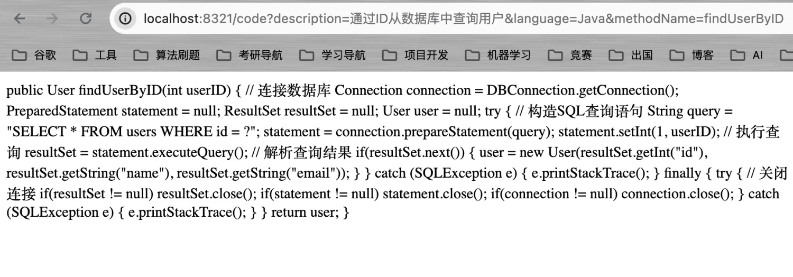
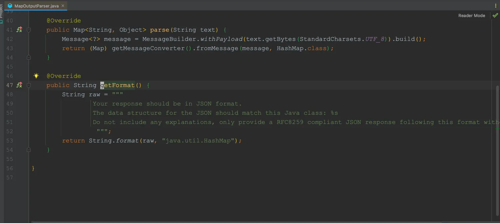

# Prompts 模板语法

&emsp;上节我们介绍了提示词工程，并通过设定SystemMessage获得了一个会骂人的AI。而本节介绍的内容仍然与提示词有关。

&emsp;Spring AI为我们提供了提示词模板，允许我们通过一些模板，快速地动态生成提示词并发起提问。除此之外，我们还能使用Spring AI为我们提供的输出解析器将AI回复的内容解析为Bean对象。

## 5.1 PromptTemplate

`PromptTemplate`能够帮助我们创建结构化提示词，是Spring AI提示词工程中的关键组件，该类实现了三个接口：`PromptTemplateStringActions`、`PromptTemplateActions`和`PromptTemplateMessageActions`,这些接口的主要功能也有所不同：

- `PromptTemplateStringActions`: 主要用于创建和渲染提示词字符串，接口的返回值类型均是String类型，这是提示词的基本形式。
- `PromptTemplateActions`: 主要用于创建Prompt对象，该对象可直接传递给ChatClient以生成响应。
- `PromptTemplateMessageActions`：主要用于创建Message对象，这允许我们针对Message对象进行其他的相关操作。


&emsp;例如，我们想定义一个这样的提示词：**提供作者姓名，返回该作者最受欢迎的书，出版时间和书的内容概述**。

```java
    @GetMapping("/template")
    public String promptTemplate(String author){
        // 提示词
        final String template = "请问{author}最受欢迎的书是哪本书？什么时候发布的？书的内容是什么？";
        PromptTemplate promptTemplate = new PromptTemplate(template);
        // 动态地将author填充进去
        Prompt prompt = promptTemplate.create(Map.of("author", author));
        
        ChatResponse chatResponse = chatClient.call(prompt);
        
        AssistantMessage assistantMessage = chatResponse.getResult().getOutput();
        return assistantMessage.getContent();
    }
```


&emsp;我们除了可以通过定义字符串加载Template以外，我们还可以以Resource的形式加载Template，例如，我们在resouces下创建`prompt.st`(文件后缀名合理即可)，将刚刚的提示词模板写入到该文件中。


```java
package com.ningning0111.controller;

import org.springframework.ai.chat.ChatClient;
import org.springframework.ai.chat.ChatResponse;
import org.springframework.ai.chat.messages.AssistantMessage;
import org.springframework.ai.chat.prompt.Prompt;
import org.springframework.ai.chat.prompt.PromptTemplate;
import org.springframework.beans.factory.annotation.Value;
import org.springframework.core.io.Resource;
import org.springframework.web.bind.annotation.GetMapping;
import org.springframework.web.bind.annotation.RestController;

import java.util.Map;

@RestController
public class ChatController {

    private final ChatClient chatClient;

    @Value("classpath:prompt.st")
    private Resource templateResource;


    public ChatController(ChatClient chatClient) {
        this.chatClient = chatClient;
    }

    @GetMapping("/template")
    public String promptTemplate(String author){
        // 提示词
        PromptTemplate promptTemplate = new PromptTemplate(templateResource);
        // 动态地将author填充进去
        Prompt prompt = promptTemplate.create(Map.of("author", author));
        ChatResponse chatResponse = chatClient.call(prompt);
        AssistantMessage assistantMessage = chatResponse.getResult().getOutput();
        return assistantMessage.getContent();
    }

}

```

## 5.2 实现代码生成器

&emsp;上面已经将Prompt的使用介绍得比较清楚了，接着我们可以使用Prompt来创建一个代码生成器的接口,通过传入描述消息、语言信息和方法名称来得到响应代码。提示词模板`code.st`文件内容如下：

```java
/**
  * @language {language}
  * @method {methodName}
  * @describe {description}
  *
  */
```

接口代码如下：

```java

    @Value("classpath:code.st")
    private Resource codeTemplate;

    @GetMapping("/code")
    public String generateCode(@RequestParam String description, @RequestParam String language, @RequestParam String methodName) {
        PromptTemplate promptTemplate = new PromptTemplate(codeTemplate);
        Prompt prompt = promptTemplate.create(
                Map.of("description", description, "language", language, "methodName", methodName)
        );
        ChatResponse chatResponse = chatClient.call(prompt);
        AssistantMessage assistantMessage = chatResponse.getResult().getOutput();
        return assistantMessage.getContent();
    }
```

效果如下：




&emsp;在设计代码生成器接口时，我们还可以提供我们项目代码的上下文信息，这样，AI就能根据我们项目里的代码信息，更加准确的生成我们可使用的业务代码了。

## 5.3 OutputParser 生成解析器
Spring AI不仅为我们提供了PromptTemplate让我们快速的构建用于输入AI的提示词，还为我们提供了OutputParser解析器，该解析器可以将AI生成的内容解析为Java Bean对象。该解析器类似于ORM框架中的Mapper，将AI的生成内容映射为Java对象。
`OutputParser`结合了`Parser<T>`和`FormatProvider`。
FormatProvider接口用于提供一些文本指令，来限制AI的输出格式，这里就用到了提示词，我们可以通过阅读源码来查看Spring AI内部设定的相关提示词：




&emsp;`Parser<T>`接口用于解析AI生成的内容并将其转换为Java对象返回。
在Spring AI中，`OutputParser`接口有三个具体的实现类：

- `BeanOutputParser`: 通过让AI生成JSON格式的文本，然后通过JSON反序列化为Java对象返回；
- `MapOutputParser`:  与BeanOutputParser的功能类似，但会将JSON反序列化为Map对象；
- `ListOutputParser`: 让AI生成以逗号分隔的列表；

**一般的，我们会先使用**`**FormatProvider**`**获取输出限制的提示词对AI生成的文本格式进行限制，然后用**`**Parser<T>**`**来解析我们生成的内容作为一个Bean对象**。

&emsp;接下来将主要演示下BeanOutputParser解析器的使用。

## 5.4 OutputParser解析器示例

&emsp;功能描述：通过传入作者名称，返回包含作者名、该作者最受欢迎的书的名称，出版时间以及书中内容描述的Java对象。
定义一个Book类，创建构造器和相关Get、Set方法：

```java
package com.ningning0111.model;

public class Book {
    private String author;
    private String bookName;
    private String publishedDate;
    private String description;
    public Book(){};

    public String getBookName() {
        return bookName;
    }

    public void setBookName(String bookName) {
        this.bookName = bookName;
    }

    public Book(String author, String publishedDate, String description, String bookName) {
        this.author = author;
        this.publishedDate = publishedDate;
        this.description = description;
        this.bookName = bookName;
    }

    public String getAuthor() {
        return author;
    }

    public String getPublishedDate() {
        return publishedDate;
    }

    public String getDescription() {
        return description;
    }

    public void setAuthor(String author) {
        this.author = author;
    }

    public void setPublishedDate(String publishedDate) {
        this.publishedDate = publishedDate;
    }

    public void setDescription(String description) {
        this.description = description;
    }
}

```

 接口代码：

```java
    @GetMapping("/bean")
    public Book getBookByAuthor(String author) {
        final String template = """
                        请告诉我{author}最受欢迎的书是哪本？什么时间出版的？书的内容描述了什么？
                        {format}
                """;
        // 定义一个输出解析器
        OutputParser<Book> bookParser = new BeanOutputParser<>(Book.class);
        PromptTemplate promptTemplate = new PromptTemplate(template);
        Prompt prompt = promptTemplate.create(Map.of("author", author, "format", bookParser.getFormat()));
        ChatResponse chatResponse = chatClient.call(prompt);
        AssistantMessage assistantMessage = chatResponse.getResult().getOutput();
        // 解析为一个Bean对象
        Book book = bookParser.parse(assistantMessage.getContent());
        return book;

    }
```


&emsp;可以看到，我们通过提示词对AI生成的内容格式进行限制后，就能很轻松地将输出内容转换为Java对象供我们使用了。
