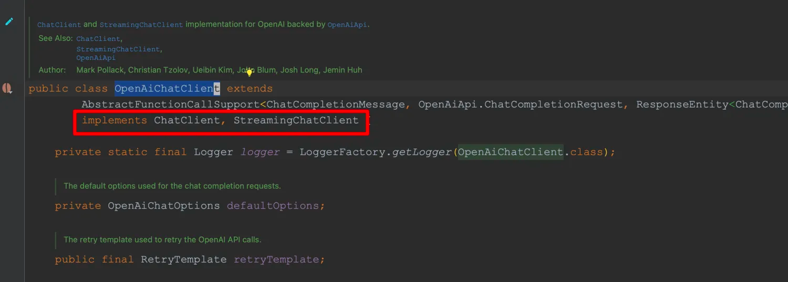
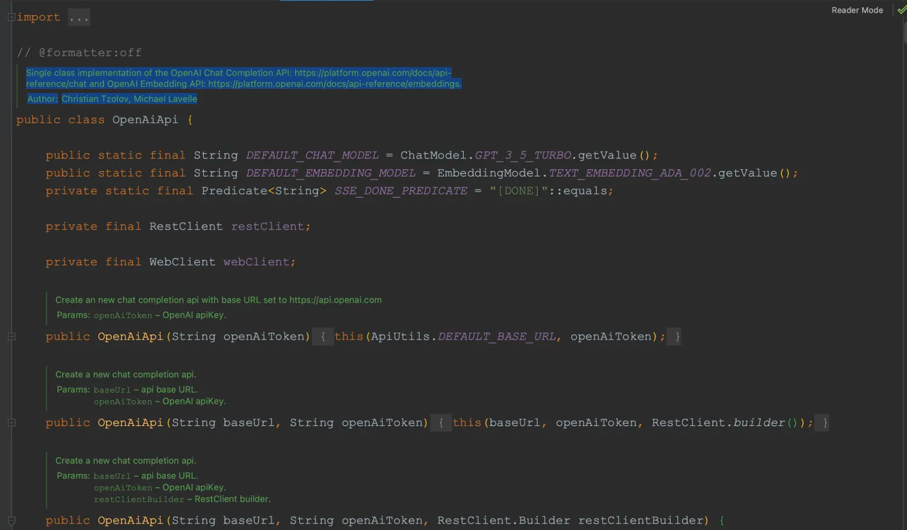
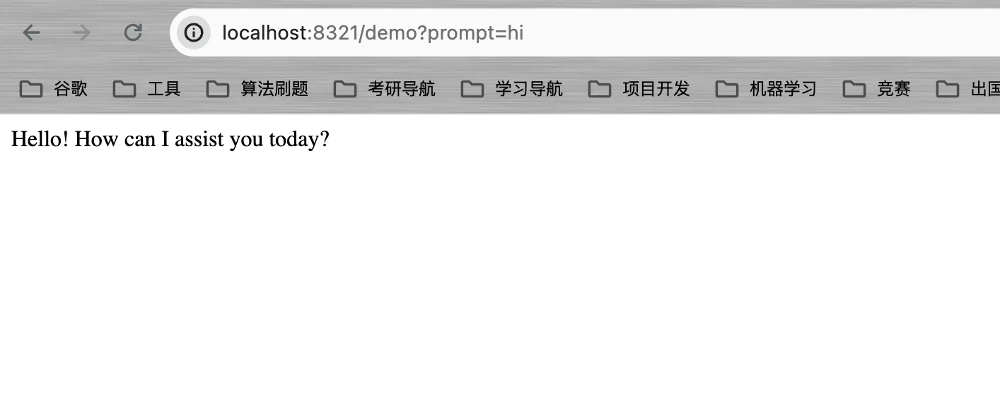

# 基于数据库的多Key轮询

&emsp;在之前的文章中我们所使用的Key都是一个，但事实上，官方对Key会有一定的请求限制，在实际业务场景下，我们也不可能通过一个Key来保证我们的系统稳定运行，因为一旦超过请求限制，就会出现无法请求AI的情况，这时，就需要考虑实现一种多Key轮询进行请求，从而保证我们的系统不会出现因为达到请求限制而无法运行的情况。
可惜的是，Spring AI目前还不支持多Key轮询的方式来调用大语言模型，因此需要我们自己实现。本篇将结合我对Spring AI的源码理解，来实现一个基于数据库的多Key轮询的接口。

## 6.1 核心类 OpenAiApi

&emsp;实现多Key轮询的方式并不难，**我们将API和Key的信息存储在数据库中，每次发起请求时，通过向数据库中查询API和Key的数据，手动构建一个ChatClient或StreamChatClient进行调用即可**。拿OpenAI为例，就是要手动构建`OpenAiChatClient`对象，因为`OpenAiChatClient`实现了`ChatClient`和`StreamChatClient`接口。




&emsp;通过观察OpenAiChatClient的构造方法，发现有一个核心类:`OpenAiApi`,该类的对象创建恰好就需要API和Key。




&emsp;因此我们很容易想通创建OpenAiChatClient的流程：

- 从数据库中查询API和Key的信息；
- 利用API和Key构建OpenAiApi对象；
- 通过OpenAiApi对象再构建OpenAiChatClient；
- 再根据实际业务场景选择ChatClient和StreamChatClient进行调用；

## 6.2 环境准备

&emsp;为便于演示，我新建了一个`spring-ai-key-polling-demo`的模块。

- 数据库使用的是Pgvector，它是Postgresql的扩展，可作为向量数据库，当然，本节还未涉及到向量数据库的使用，因此可以根据自己的喜好选择一个数据库；
- ORM框架：Spring Data JPA，演示起来比较方便，可根据喜好选择一款ORM框架

核心依赖：

```xml
<dependency>
  <groupId>org.springframework.ai</groupId>
  <artifactId>spring-ai-openai-spring-boot-starter</artifactId>
</dependency>
<dependency>
  <groupId>org.springframework.boot</groupId>
  <artifactId>spring-boot-starter-data-jpa</artifactId>
</dependency>
<dependency>
  <groupId>org.postgresql</groupId>
  <artifactId>postgresql</artifactId>
</dependency>
<dependency>
  <groupId>org.projectlombok</groupId>
  <artifactId>lombok</artifactId>
</dependency>
```

目录结构如下：


## 6.3 多Key轮询的基本实现

#### (1) 定义实体类

&emsp;这里我定义了一个KeyInfo用来存储我们的Key和API信息,属性较为简单，实际项目中需要结合实际的业务场景添加一些额外的属性，如是否禁用、创建时间等等。

```java
package com.ningning0111.entity;

import jakarta.annotation.Nullable;
import jakarta.persistence.*;
import lombok.AllArgsConstructor;
import lombok.Data;
import lombok.NoArgsConstructor;

@Data
@AllArgsConstructor
@NoArgsConstructor
@Entity
@Table
public class KeyInfo {
    @Id
    @GeneratedValue(strategy = GenerationType.IDENTITY)
    private Long id;
    @Column(nullable = false)
    private String key;
    @Column(nullable = false,columnDefinition = "VARCHAR(50) DEFAULT 'https://api.openai.com'")
    private String api;

    // 描述这个Key干嘛的 可空
    private String description;

}

```

#### (2) 定义Repository

&emsp;由于使用的是JPA，这里还需要创建Repository,对于Mybatis，需要创建Mapper。

```java
package com.ningning0111.repository;

import com.ningning0111.entity.KeyInfo;
import org.springframework.data.jpa.repository.JpaRepository;
import org.springframework.stereotype.Repository;

@Repository
public interface KeyInfoRepository extends JpaRepository<KeyInfo,Long> {
}

```
	
#### (3) 配置文件

&emsp;接着我们需要配置`application.yml`文件：

```yml
server:
  port: 8321

spring:
  datasource:
    driver-class-name: org.postgresql.Driver
    username: postgres
    password: postgres
    url: jdbc:postgresql://localhost/demo
  jpa:
    hibernate:
      # 自动创建表
      ddl-auto: create
    show-sql: true
    open-in-view: true
    
  autoconfigure:
    exclude: org.springframework.ai.autoconfigure.openai.OpenAiAutoConfiguration
```
	
&emsp;因为我们的Key和API都是从数据库中获取的，因此配置文件中就不需要配置了，为了防止相关属性因为无法自动配置而造成Spring启动不起来，就需要将OpenAi的自动装配排除。

#### (3) Service类

```java
package com.ningning0111.service;

import com.ningning0111.entity.KeyInfo;
import com.ningning0111.repository.KeyInfoRepository;
import jakarta.annotation.PostConstruct;
import lombok.RequiredArgsConstructor;
import org.springframework.ai.chat.ChatClient;
import org.springframework.ai.chat.StreamingChatClient;
import org.springframework.ai.openai.OpenAiChatClient;
import org.springframework.ai.openai.api.OpenAiApi;
import org.springframework.stereotype.Service;

import java.util.List;
import java.util.Random;

@RequiredArgsConstructor
@Service
public class ChatService {
    private final KeyInfoRepository repository;

    // 初始化一些key 这些key应该是可调用的
    @PostConstruct
    public void initData() {
        KeyInfo keyInfo = new KeyInfo();
        keyInfo.setKey("sk-W9kYxxxxxxxxxxxxxxxxxxxfAd460353Dc7a");
        keyInfo.setApi("https://api.mnzdna.xyz");
        keyInfo.setDescription("测试API和Key，请填写自己的Key");
        repository.save(keyInfo);
    }

    // 阻塞式
    public ChatClient getChatClient() {
        OpenAiApi openAiApi = randomGetApi();
        assert openAiApi != null;
        return new OpenAiChatClient(openAiApi);
    }

    // 流式
    public StreamingChatClient getStreamChatClient() {
        OpenAiApi openAiApi = randomGetApi();
        assert openAiApi != null;
        return new OpenAiChatClient(openAiApi);
    }

    // 随机获取一个OpenAiApi
    private OpenAiApi randomGetApi(){
        List<KeyInfo> keyInfoList = repository.findAll();
        // 如果数据库中没有KeyInfo对象，则返回null
        if (keyInfoList.isEmpty()) {
            return null;
        }
        // 随机选择一个KeyInfo对象
        Random random = new Random();
        KeyInfo randomKeyInfo = keyInfoList.get(random.nextInt(keyInfoList.size()));
        return new OpenAiApi(randomKeyInfo.getApi(),randomKeyInfo.getKey());
    }
}

```

#### (4) Controller类

```java
package com.ningning0111.controller;

import com.ningning0111.service.ChatService;
import lombok.RequiredArgsConstructor;
import org.springframework.ai.chat.ChatClient;
import org.springframework.web.bind.annotation.GetMapping;
import org.springframework.web.bind.annotation.RestController;

@RestController
@RequiredArgsConstructor
public class ChatController {
    private final ChatService chatService;
    @GetMapping("/demo")
    public String chatDemo(String prompt){
        ChatClient chatClient = chatService.getChatClient();
        String response = chatClient.call(prompt);
        return response;
    }
}

```


效果如下：




## 6.4 多Key轮询的优化

&emsp;上面的代码是多Key轮询实现的简单方式，但是，由于每次对话都需要从数据库中进行查询，再加上查询到结果后还需要发起网络请求等待响应，因此当Key的数量特别多时，会大大增加响应的时间。为此，我们有必要对其进行优化。这里简单介绍下我使用过的优化方式：

- 容器启动时，先将数据库里的数据加载到内存中，即：使用List存储；
- 针对实体KeyInfo的增删改操作，每次操作完成后重新从数据库中加载数据到内存中；
- 每次轮询都是基于List进行的，而不再是基于数据库；
- 当轮询到的Key失效时，将其从数据库中删除（删除后会重新加载）
- 每次轮询前对List进行判空，若空，则重新从数据库加载数据

&emsp;具体的实现代码就不展示了，实现逻辑并不难，并且优化策略也有很多，可以结合实际情况实现。
