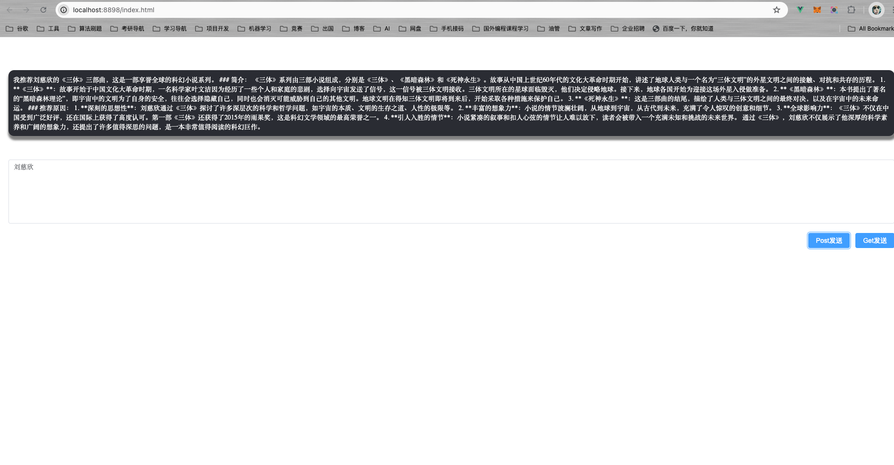
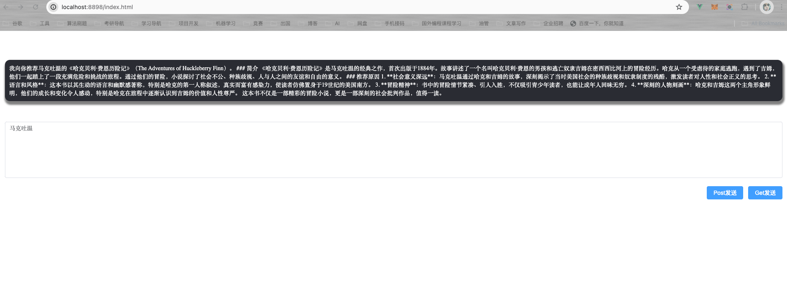

# 基于Vue3实现流式输出

&emsp;应网友的需要，本篇将介绍下如何使用Vue3去调用Spring AI实现的流式输出接口。整个流程演示基于前后端分离。

## 流式接口回顾

&emsp;目前大模型的流式响应接口所采用的技术主要是两种：**WebSocket**和**SSE**。这两种方式都支持服务端主动向客户端发送内容，其中，Websocket是一种双向通信协议，可以在一个连接上进行双向通信，即：客户端可以向服务端发送信息，服务端也可以主动向客户端发送信息。而SSE是基于标准的Http协议实现的，是一种单向信道，即：只支持服务端向客户端发送数据。一般我们主要是通过`EventSource`事件源来监听并获取服务端的消息。

&emsp;回顾流式对话的博客文章，我们使用Spring AI实现的流式接口如下：

```java
    // 流式调用 将produces声明为文本事件流
    @GetMapping(value = "/stream",produces = MediaType.TEXT_EVENT_STREAM_VALUE)
    public Flux<String> stream(String prompt){
        // 将流中的内容按顺序返回
        return streamingChatClient.stream(prompt).flatMapSequential(Flux::just);
    }
```

&emsp;对于这个接口的定义，不言而喻是基于Http协议的，而我们使用produces将响应内容声明为事件流，其实也就说明我们的流式接口是一个SSE接口。

> 一般的，Websocket比较占用资源，因为是双向通信，一旦建立连接不断开，就会一直占用资源，所以不推荐使用Websocket。并且，Websocket的主要应用场景是在线聊天、实时游戏等，与我们的**请求AI，AI响应我们**有所不同。

## 前端发起SSE

&emsp;这里我就直接跳过对SSE请求的原理介绍，感兴趣的同学可以自行谷歌学习。前端发起请求无非就两种技术：**axios**和**fetch**，相信大部分人了解axios胜过fetch。但不幸的是，**axios并不支持流事件，而fetch支持**。因此对接SSE接口需要使用fetch或基于fetch实现的第三方请求库。

&emsp;这里我推荐一个微软开源的事件流请求库：`fetch-event-source`。

- GitHub: [https://github.com/Azure/fetch-event-source](https://github.com/Azure/fetch-event-source)

&emsp;`fetch-event-source`是基于fetch实现的、用于快速处理事件流请求的第三方库，它简化了事件流请求的操作，便于我们更好地处理这类请求。以发起SSE请求为例：

### POST请求

```typescript
const ctrl = new AbortController();
fetchEventSource('/api/sse', {
    method: 'POST',
    headers: {
        'Content-Type': 'application/json',
    },
    body: JSON.stringify({
        foo: 'bar'
    }),
    signal: ctrl.signal,
    onmessage: (message)=>{
        // 处理监听到的消息
    },
    onclose: ()=>{
        // 连接关闭后处理逻辑
    },
    onerror: (err)=>{
        // 发生错误后调用
    }
    // Get请求处理如上相同
});
```

### Get请求

```typescript
const url = new URL(baseUrl);
  Object.keys(params).forEach(key => url.searchParams.append(key, params[key].toString()));
const requestUrl = url.toString();
fetchEventSource(requestUrl, {
    method: 'GET',
    headers: {
        'Content-Type': 'application/json',
    },
    body:null,
    signal: ctrl.signal,
});
```

&emsp;介绍完基于Post和Get的SSE请求操作后，我们再回过来看最开始的流式接口：

```java
    @GetMapping(value = "/stream",produces = MediaType.TEXT_EVENT_STREAM_VALUE)
    public Flux<String> stream(String prompt){
        // 将流中的内容按顺序返回
        return streamingChatClient.stream(prompt).flatMapSequential(Flux::just);
    }
```

&emsp;调用它，只需这样做：

```typescript
const BaseUrl = "http://localhost:[port]/stream";
const prompt = "你的问题";
fetchEventSource(BaseUrl + "?prompt=" + prompt, {
    method: "GET",
    headers: {
        "Content-Type": "application/json",
    },
    body: null,
    signal: ctrl.signal,
    onmessage: (message)=>{
        // 处理响应的数据，该数据是一段一段的
    }
});
```

&emsp;文章介绍到这里其实就差不多了，动手能力强的同学一定可以写出自己使用Spring AI实现的各种需要传参数的流式接口。在写这篇博客时，我已经实现了一个基于Vue3实现了一个前后端分离的Demo。请求的核心代码摘至于下：

&emsp;详见可查看仓库代码：[https://github.com/NingNing0111/spring-ai-zh-tutorial](https://github.com/NingNing0111/spring-ai-zh-tutorial/blob/master/spring-ai-v1-stream-chat-demo/src/main/resources/core/src/api/index.ts)

```typescript
import { fetchEventSource } from "@microsoft/fetch-event-source";
class FatalError extends Error {}
class RetriableError extends Error {}

type ResultCallBack = (e: any | null) => void;

const BaseUrl = "http://localhost:8898";
export const postStreamChat = (
  author: string,
  onMessage: ResultCallBack,
  onError: ResultCallBack,
  onClose: ResultCallBack
) => {
  const ctrl = new AbortController();
  fetchEventSource(BaseUrl + "/post-chat", {
    method: "POST",
    headers: {
      "Content-Type": "application/json",
    },
    body: JSON.stringify({
      author: author,
    }),
    signal: ctrl.signal,
    onmessage: onMessage,
    onerror: (err: any) => {
      onError(err);
    },
    onclose: () => {
      onClose(null);
    },
    onopen: async (response: any) => {
      if (response.ok) {
        return;
      } else if (
        response.status >= 400 &&
        response.status < 500 &&
        response.status !== 429
      ) {
        throw new FatalError();
      } else {
        throw new RetriableError();
      }
    },
  });
};

export const getStreamChat = (
  author: string,
  onMessage: ResultCallBack,
  onError: ResultCallBack,
  onClose: ResultCallBack
) => {
  const ctrl = new AbortController();
  fetchEventSource(BaseUrl + "/get-chat?author=" + author, {
    method: "GET",
    headers: {
      "Content-Type": "application/json",
    },
    body: null,
    signal: ctrl.signal,
    onmessage: onMessage,
    onerror: (err: any) => {
      onError(err);
    },
    onclose: () => {
      onClose(null);
    },
    onopen: async (response: any) => {
      if (response.ok) {
        return;
      } else if (
        response.status >= 400 &&
        response.status < 500 &&
        response.status !== 429
      ) {
        throw new FatalError();
      } else {
        throw new RetriableError();
      }
    },
  });
};
```

## Demo注意事项

- 基于Vue3实现，node版本:v18.16.0。
- 项目已build，启动`spring-ai-v1-stream-chat-demo`项目后,可直接通过`http://localhost:8898/index.html` 访问网页。
- Spring AI版本采用的是最新的1.0,与之前的0.8相比，对话接口类有所改变，需要注意。

## 效果图


&emsp;Post请求：




&emsp;Get请求:





