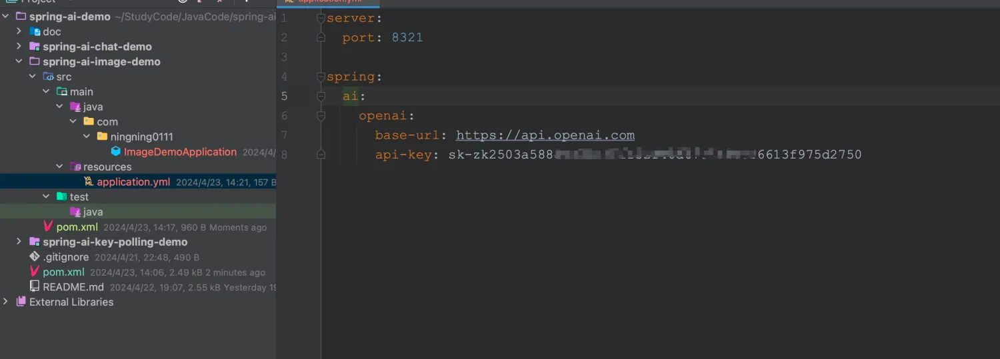
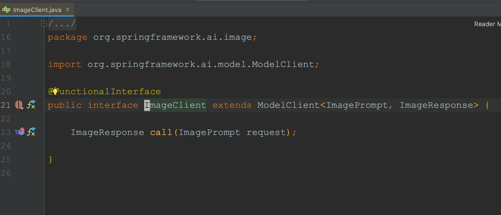
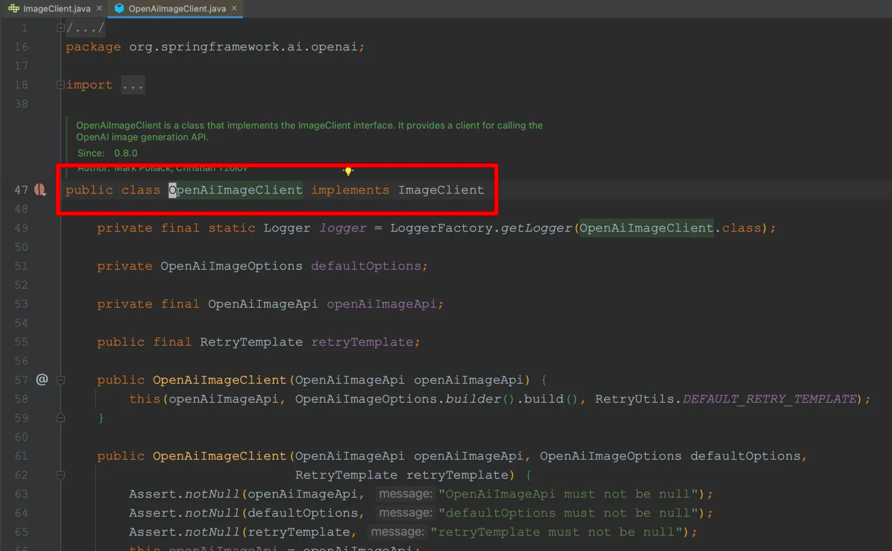
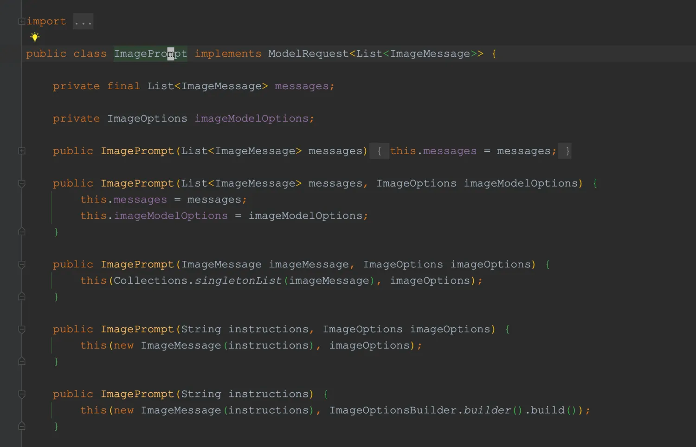
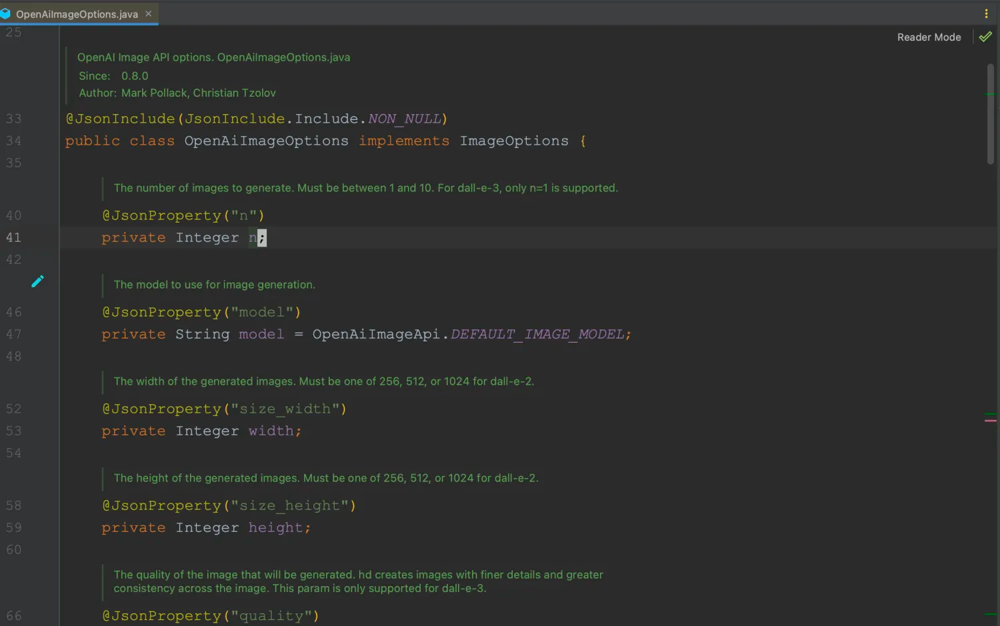
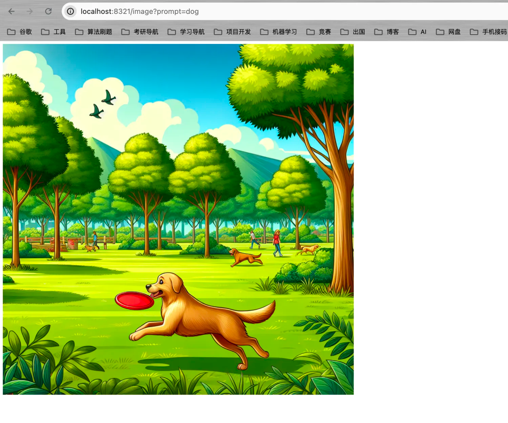

# 快速入门

&emsp;Spring AI提供了图片生成接口，该接口可以用于与各种专门用于图像生成的人工智能模型进行交互，允许开发人员以最少的代码更在在不同的图像相关模型之间切换。
目前，图像生成接口支持OpenAI和Stability AI。后者的API格式是OpenAI的格式。

&emsp;对于OpenAI的图像生成，我们继续使用`spring-ai-openai-spring-boot-starter`依赖即可，对于Stability AI的图像生成，我们就需要引入下面的依赖：

```java
<dependency>
    <groupId>org.springframework.ai</groupId>
    <artifactId>spring-ai-stability-ai-spring-boot-starter</artifactId>
</dependency>
```
	
&emsp;这里我们主要还是以OpenAI为主。

## 1.1 项目搭建

&emsp;引入`spring-ai-openai-spring-boot-starter`后将相关信息进行配置。



## 1.2 源码介绍

&emsp;在Chat API那章中，我们的对话使用的是ChatClient，举一反三得，绘图接口就是ImageClient。Spring AI的核心绘图接口就是`ImageClient`，`spring-ai-openai`中对该接口进行具体的实现是`OpenAiImageClient`类。







&emsp;在调用绘图时，我们只需要像调用对话一样传入一个Prompt:`ImagePrompt`。ImagePrompt中包含了我们需要绘制的图片信息，包括：ImageMessage(绘图指令)、ImageOptions(图片数、图片配置、返回的图片格式、绘图模型等)。AI拿到我们的Prompt后会根据里面的内容对图像进行生产。



&emsp;在调用绘图时，我们只需要重点关注`ImageOptions`即可。`ImageMessage`一般是以字符串的形式构建，例如："帮我画一张小狗的图片"、"帮我画一张小猫的图片"。而ImageOptions则涉及到图片的大小、数量、返回的格式以及调用模型等。

&emsp;OpenAI的绘图调用有一个对`ImageOptions`接口的具体实现:`OpenAiImageOptions`。该类对象的创建采用建造者模式，默认调用的模型是`dall-e-3`。




&emsp;需要注意的是，每个模型所支持的图片尺寸有所不同：

- dall-e-3：1024 x 1024 、 1024 x 1792、1792 x 1024;
- dall-e-2: 256 x 256、512 x 512 、 1024 x 1024;

&emsp;图片的响应格式主要有两种：url 和 b64_json。

## 1.3 绘图

&emsp;下面我们就简单的实现下`dall-e-3`模型的绘图接口：

```java
package com.ningning0111.controller;

import org.springframework.ai.image.ImageClient;
import org.springframework.ai.image.ImageGeneration;
import org.springframework.ai.image.ImagePrompt;
import org.springframework.ai.image.ImageResponse;
import org.springframework.ai.openai.OpenAiImageOptions;
import org.springframework.ai.openai.api.OpenAiImageApi;
import org.springframework.web.bind.annotation.GetMapping;
import org.springframework.web.bind.annotation.RestController;

import java.util.List;

@RestController
public class ImageController {
    private final ImageClient imageClient;

    public ImageController(ImageClient imageClient) {
        this.imageClient = imageClient;
    }

    @GetMapping("/image")
    public String image(String prompt) {
        ImagePrompt imagePrompt =
                new ImagePrompt(prompt, OpenAiImageOptions.builder()
                        .withModel(OpenAiImageApi.ImageModel.DALL_E_3.getValue())
                        .withHeight(1024)
                        .withWidth(1024)
                        .withResponseFormat("url") // URL or b64_json
                        .build());
        ImageResponse imageResponse = imageClient.call(imagePrompt);
        List<ImageGeneration> results = imageResponse.getResults();
        // 图片url
        String url = results.get(0).getOutput().getUrl();
        return String.format("",url,prompt);
    }
}

```



