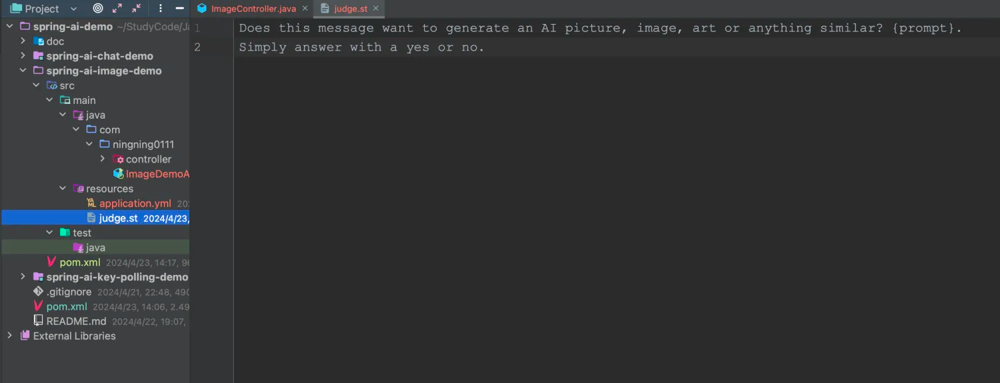
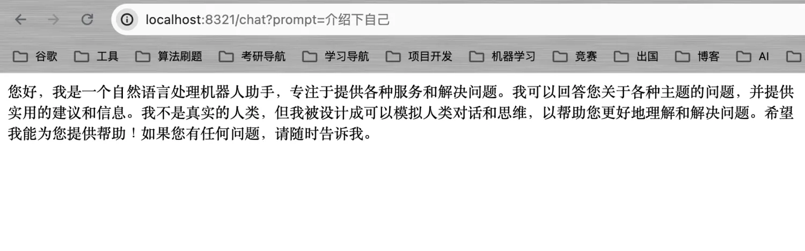
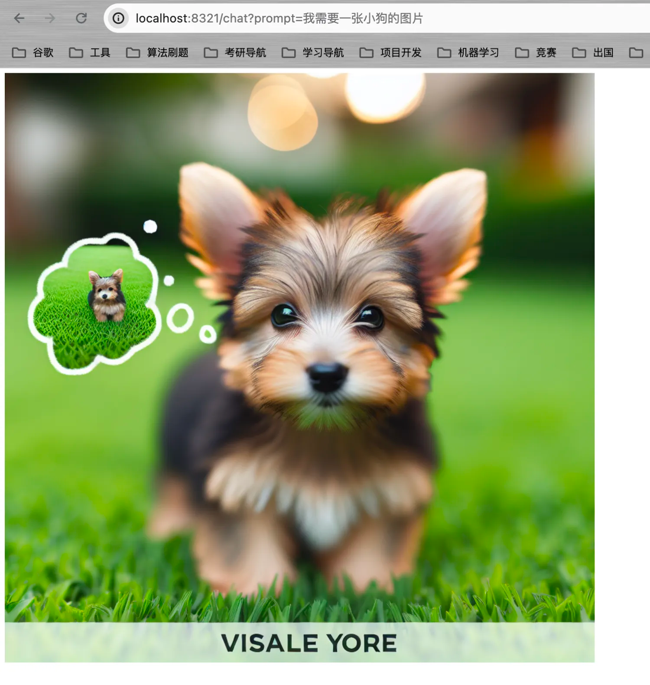
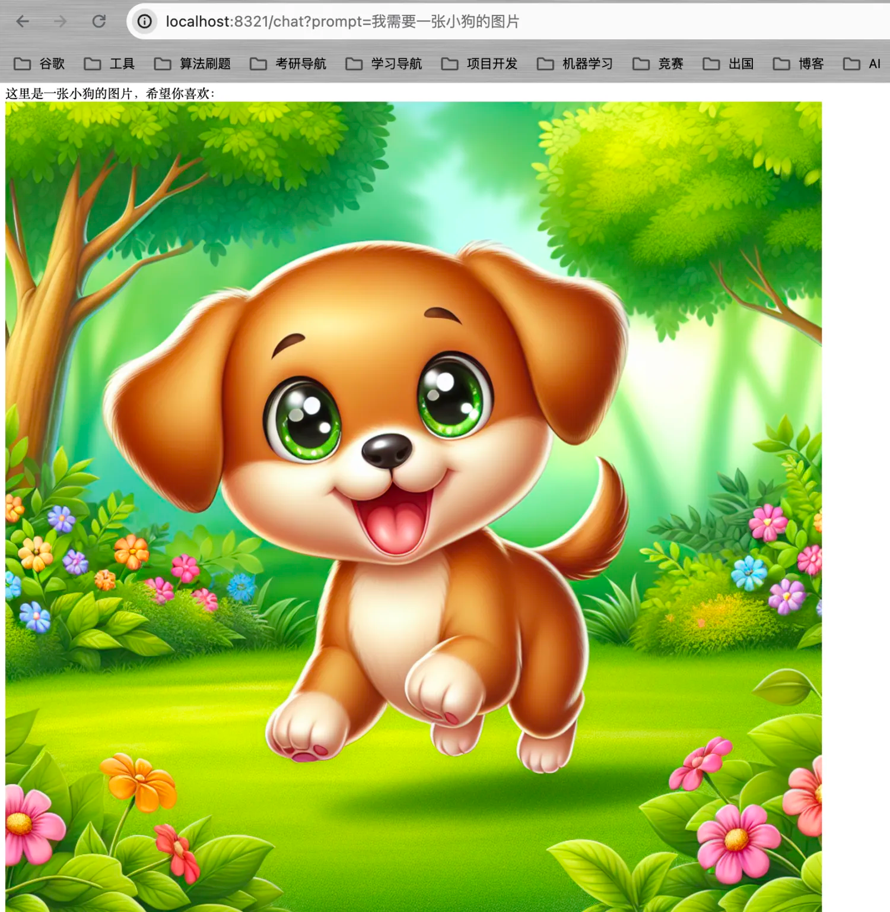

# AI自查对文本对话还是图片绘制进行判断

&emsp;多模态大语言模型一直是AI发展的趋势，什么是多模态大模型？简单理解就是这个模型可以处理文本、音频、图像、视频等各种信息。我们经常使用的ChatGPT 3.5模型只能处理文本数据，我们想让它生产图片，它是无法生成的，这就不是多模态的。

&emsp;不过，我们可以通过AI自查手段将文本模型和图片生成模型进行组合实现一个既可以生成文本也可以生成AI的接口。这个关键点就是利用提示词限制AI的回复内容以达到一个自查手段。

&emsp;AI自查就是让AI判断你的问题是画一个图还是简简单单的对话。

- 用户输入文本prompt;
- 先让AI判断文本prompt是否需要图片;
- 如果需要图片，调用绘图模型获取绘图结果；
- 如果不需要图片，直接调用对话模型;'

&emsp;从上面的流程可以看到，你的自查准确度取决于你的提示词质量。下面我们就简单的实现一个**既可以对话也可以画图的接口**。

## 2.1 定义提示词

&emsp;首先，我们需要完成自查的提示词，我们希望给一段文本，让AI判断是否是画图，如果是，返回yes，不是则返回no。参考的提示词如下：

`Does this message want to generate an AI picture, image, art or anything similar? {prompt} . Simply answer with a yes or no.`

> 为什么用英文？ChatGPT更适合英文文本的识别和生成，因此为了保证判断的准确率，建议使用英文的提示词。



## 2.2 Service

```java
package com.ningning0111.service;

import org.springframework.ai.chat.ChatClient;
import org.springframework.ai.chat.ChatResponse;
import org.springframework.ai.chat.prompt.Prompt;
import org.springframework.ai.chat.prompt.PromptTemplate;
import org.springframework.ai.image.ImageClient;
import org.springframework.ai.image.ImagePrompt;
import org.springframework.ai.image.ImageResponse;
import org.springframework.ai.openai.OpenAiImageOptions;
import org.springframework.beans.factory.annotation.Value;
import org.springframework.core.io.Resource;
import org.springframework.stereotype.Service;

import java.util.Map;

@Service
public class AIService {
    @Value("classpath:judge.st")
    private Resource judgeTemplate;

    private final ChatClient chatClient;
    private final ImageClient imageClient;

    public AIService(ChatClient chatClient, ImageClient imageClient) {
        this.chatClient = chatClient;
        this.imageClient = imageClient;
    }

    public String aiChat(String prompt) {

        return judge(prompt) ? image(prompt) : chat(prompt);
    }

    private boolean judge(String prompt) {
        // 构建提示词
        PromptTemplate promptTemplate = new PromptTemplate(judgeTemplate);
        Prompt p = promptTemplate.create(Map.of("prompt", prompt));
        ChatResponse chatResponse = chatClient.call(p);
        String judgeResult = chatResponse.getResult().getOutput().getContent();
        System.out.println(judgeResult);
        switch (judgeResult.toLowerCase()) {
            case "yes", "yes.":
                return true;
            default:
                return false;
        }
    }

    private String image(String prompt) {
        ImagePrompt imagePrompt =
                new ImagePrompt(prompt, OpenAiImageOptions.builder()
                        .withResponseFormat("url")
                        .withWidth(1024)
                        .withHeight(1024)
                        .build());
        ImageResponse imageResponse = imageClient.call(imagePrompt);
        String url = imageResponse.getResult().getOutput().getUrl();
        return String.format("",url,prompt);
    }

    private String chat(String prompt) {
        Prompt chatPrompt = new Prompt(prompt);
        ChatResponse chatResponse = chatClient.call(chatPrompt);
        return chatResponse.getResult().getOutput().getContent();
    }
}

```

## 2.3 Controller

```java
package com.ningning0111.controller;

import com.ningning0111.service.AIService;
import org.springframework.web.bind.annotation.GetMapping;
import org.springframework.web.bind.annotation.RestController;

@RestController
public class ImageController {

    private final AIService aiService;

    public ImageController(AIService aiService) {
        this.aiService = aiService;
    }

    @GetMapping("/chat")
    public String chat(String prompt) {
        return aiService.aiChat(prompt);
    }
}

```

效果如下：





> 我们能否让AI回复的文本内容中嵌套一些图片呢？答案是可以的，实现方式还是利用提示词技术，这里就不带着大家实现了。

```java
    public String aiChat(String prompt) {
        if(judge(prompt)){
            final String template = "我为你提供了图片信息：{prompt}-{url}。你需要结合图片信息对问题进行回复。注意，你的回复内容需要表现得天生就知道这些图片信息一样。";
            SystemPromptTemplate promptTemplate = new SystemPromptTemplate(template);
            String url = image(prompt);
            Message systemMessage = promptTemplate.createMessage(Map.of("prompt", prompt, "url", url));
            ChatResponse chatResponse = chatClient.call(new Prompt(List.of(systemMessage, new UserMessage(prompt))));
            return chatResponse.getResult().getOutput().getContent();
        }
        return chat(prompt);

    }
```

效果如下：

