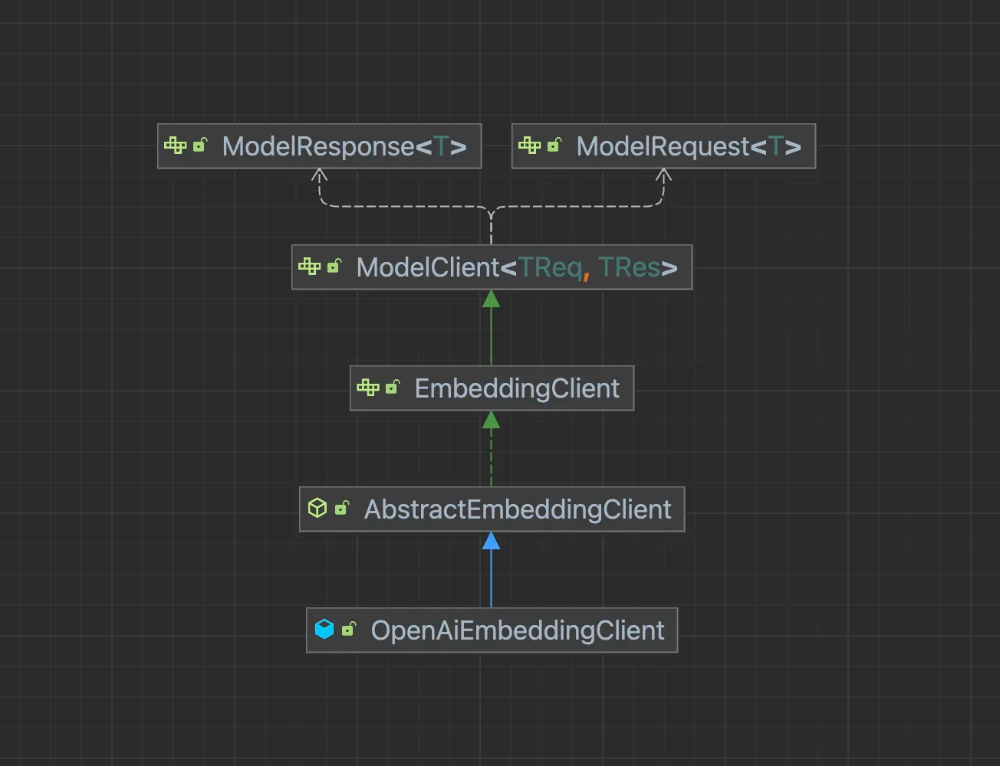
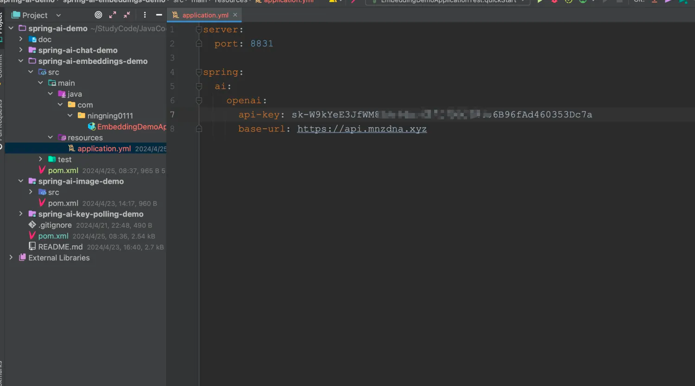
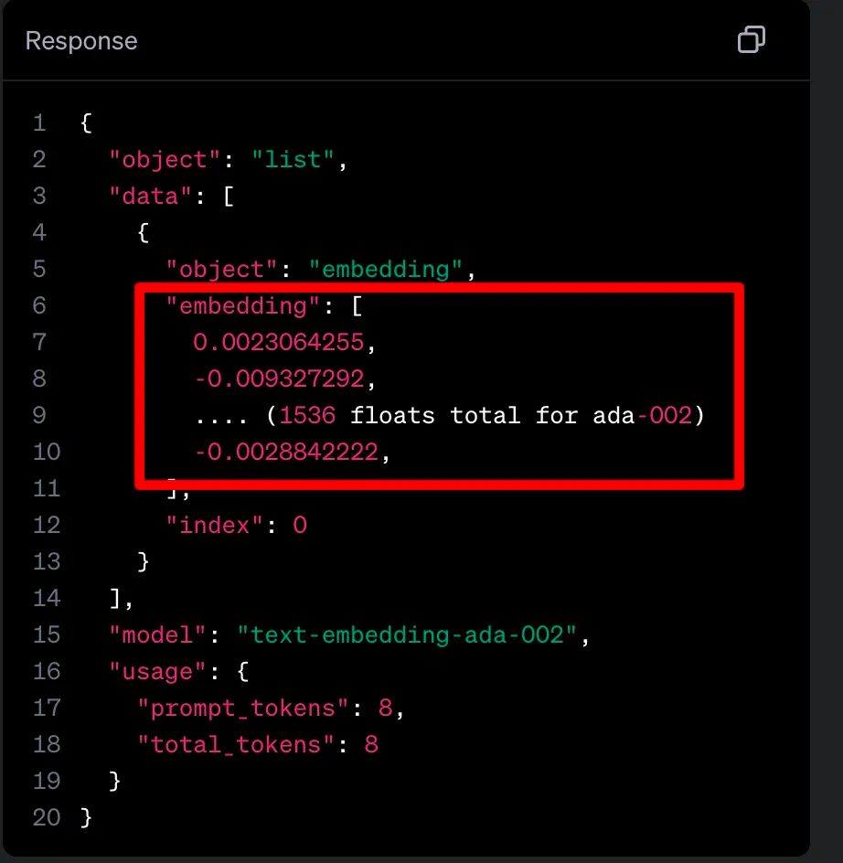
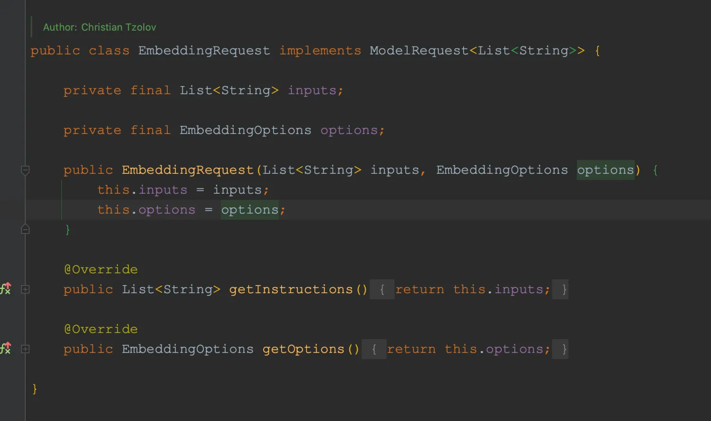
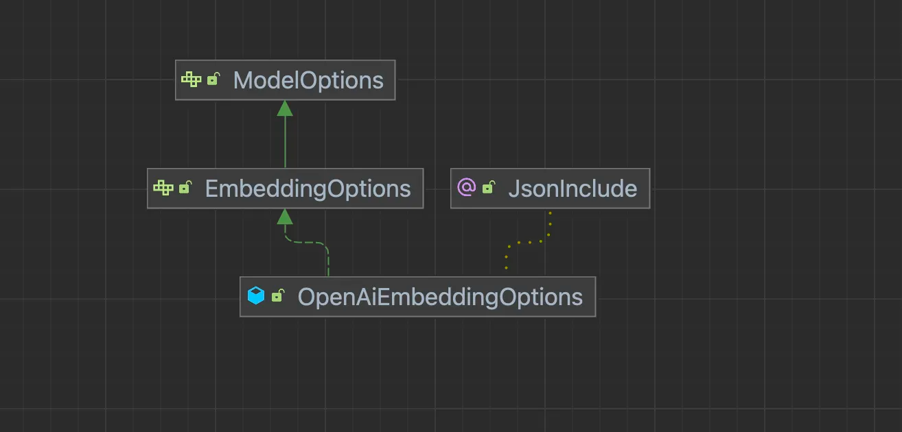
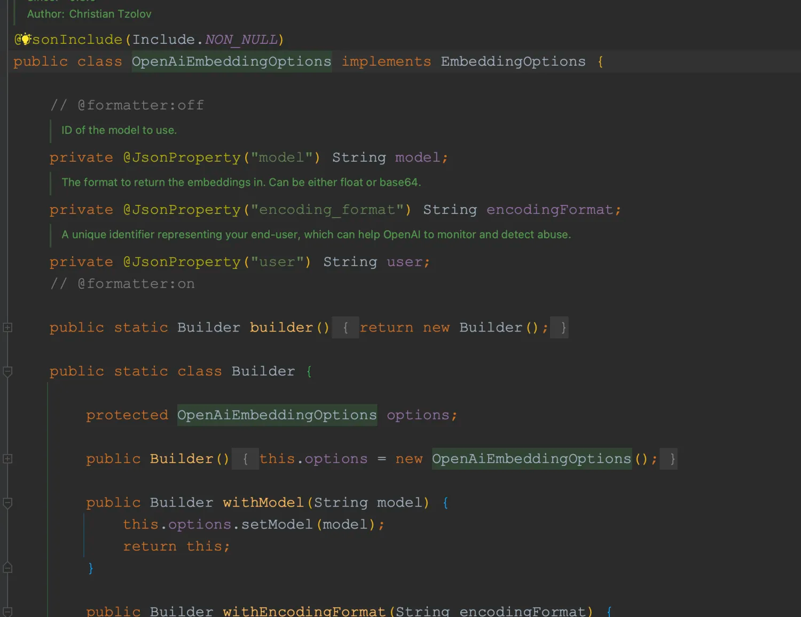
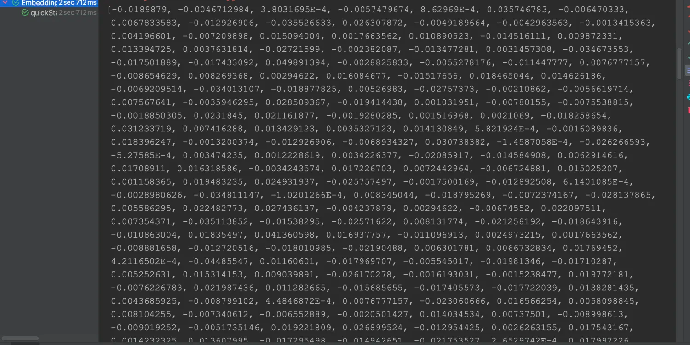

# 快速入门

&emsp;Spring AI 的 Embeddings API的功能是调用各平台（目前包括：OpenAI、Ollama、Azure OpenAI等）的嵌入模型将文本转换为数值向量。这些文本向量化后的数值数据对于文本分析和检索有着至关重要的作用。

&emsp; 同样的`spring-ai-openai-spring-boot-starter`里有对`EmbeddingClient`接口的实现类：`OpenAiEmbeddingClient`,该类支持调用OpenAI的两种嵌入模型：`text-embedding-ada-002`和`text-embedding-3`。



&emsp;与`OpenAiClient`和`OpenAiImageClient`类似的，当Spring 启动时，会自动注入`OpenAiEmbeddingClient`，因此完成key和url的配置后，我们就能直接使用。




## 源码解读

&emsp;嵌入模型的主要工作就是将一些原数据进行降为，从而获得一组低维的数据。拿OpenAI的嵌入模型来说，它的功能十分简单，给它一段文本，它会返回一组这段文本的向量化数据。



&emsp;`EmbeddingClient`的调用需要传入一个`EmbeddingRequest`对象进行调用。该类中包含一组文本列表和执行嵌入的配置信息。



&emsp;同样的，我们只需关注options，在`spring-ai-openai-spring-boot-starter`中提供了EmbeddingOptions接口的实现类:`OpenAiEmbeddingOptions`。



&emsp;在该类中，只需关注model和encodingFormat。



&emsp;model用于指定嵌入模型：text-embedding-ada-002或text-embedding-3；

&emsp;encodingFormat一般传入float就行。

## 调用嵌入模型

&emsp;下面就通过`EmbeddingClient`调用text-embedding-ada-002模型将一段文本向量化并获取向量化后的向量值。
```java
package com.ningning0111;

import org.junit.jupiter.api.Test;
import org.springframework.ai.embedding.EmbeddingClient;
import org.springframework.ai.embedding.EmbeddingRequest;
import org.springframework.ai.embedding.EmbeddingResponse;
import org.springframework.ai.openai.OpenAiEmbeddingOptions;
import org.springframework.beans.factory.annotation.Autowired;
import org.springframework.boot.test.context.SpringBootTest;

import java.util.List;

@SpringBootTest
public class EmbeddingDemoApplicationTest {

    @Autowired
    private EmbeddingClient embeddingClient;

    @Test
    public void quickStart() {
        String vectorString = "I'm learning Spring AI";
        EmbeddingRequest embeddingRequest =
                new EmbeddingRequest(List.of(vectorString),
                        OpenAiEmbeddingOptions.builder()
                                .withEncodingFormat("float")
                                .withModel("text-embedding-ada-002")
                                .build());

        EmbeddingResponse response = embeddingClient.call(embeddingRequest);
        System.out.println(response.getResult().getOutput());
    }
}

```
执行结果如下：


