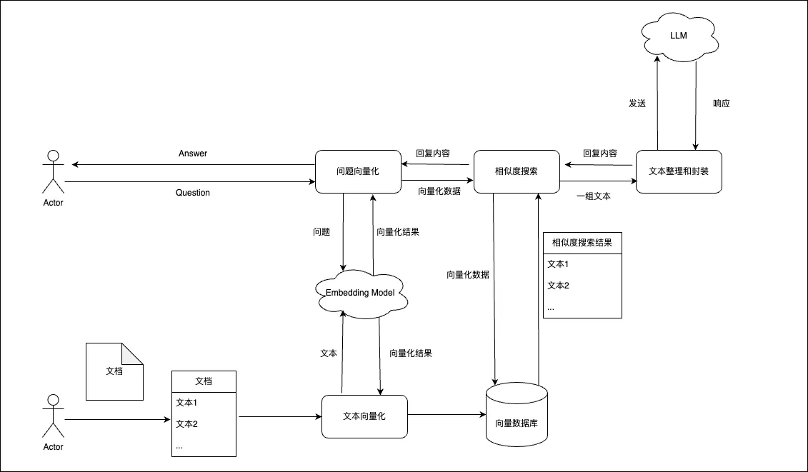

# 向量数据库概述

## 2.1 传统大模型的限制

&emsp;在Spring AI Chat API之上下文对话中，我们通过维护一个历史对话实现了一个具备记忆力的对话接口。但是目前传统大模型都有一个Token限制，这个限制你可以理解为传给AI的字符数，当你维护的历史对话越长，突破Token限制的可能性就越高，一旦突破Token限制，AI就无法回复。再比如，我想让ChatGPT帮我总结一篇30页的论文，必要时还需要让ChatGPT快速帮我解释论文中的概念性名词，这时我们直接将论文内容+问题发给ChatGPT就非常不现实，一方面，这会突破Token限制，另一方面，即使没有突破Token限制，也会产生大量的、没必要的费用开销。那么，我们该如何让ChatGPT帮我们处理超大文本呢？这就需要用到向量数据库了。

## 2.2 向量数据库

&emsp;针对传统大模型的Token限制，开发者想到了一种解决方案，就是使用向量数据库。向量数据库除了存储必要的元数据(如文本、图片)外，还会存储对应元数据的向量。与传统的数据库执行的精确性搜索不同的是，向量数据库执行的是相似性搜索。执行相似性搜索的算法有很多，比较容易理解的是计算两个向量之间的距离来判断是否相似。目前主流的向量数据库有：[Chroma](https://www.trychroma.com/)、[Milvus](https://milvus.io/)、[Pgvector](https://github.com/pgvector/pgvector)、[Redis](https://redis.io/)、[Neo4j](https://neo4j.com/)；

## 2.3 RAG技术

&emsp;向量数据库执行搜索后的结果是一组与用户问题相似的数据，在让AI处理超大文本时，只需将这组数据发送给AI即可，这不仅解决了传入超大文本时突破Token限制，还节省了大量的没必要的开销。而这种方式就是增强检索生成(RAG)。

&emsp;在Spring AI中，实现RAG是非常容易的，我们可以使用`EmbeddingClient`将文本转为向量存储到向量数据库中，当然，对于超大文本，我们需要将文本进行分割然后依次向量化存储；在对话时，从向量数据库中执行相似性搜索获取与问题相关的一组文本，然后将这组文本和问题一起发送给AI就行了。
