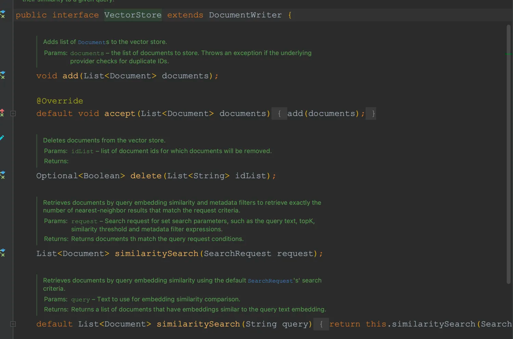
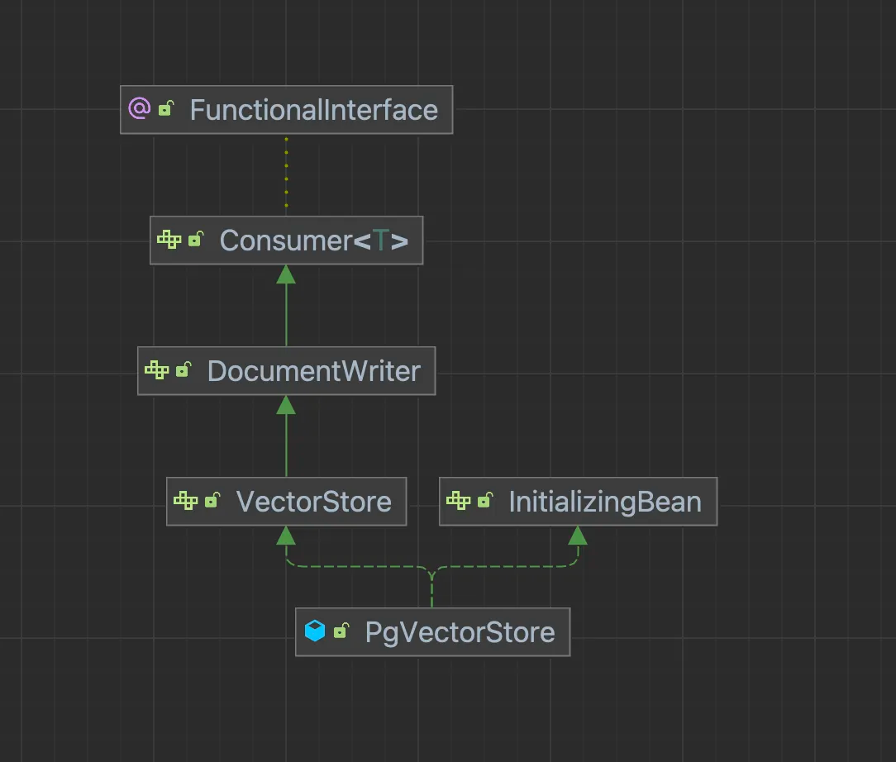
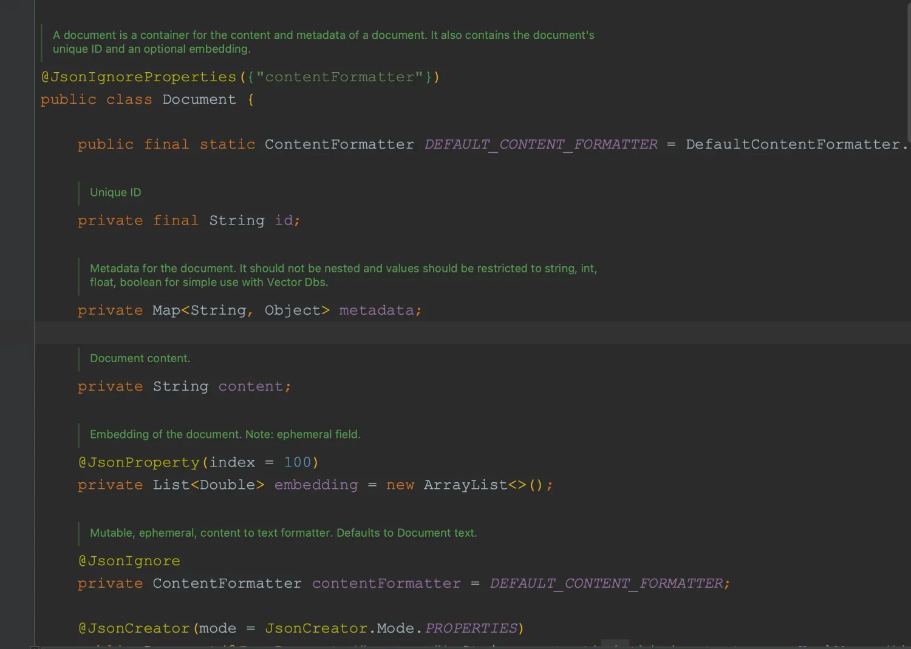
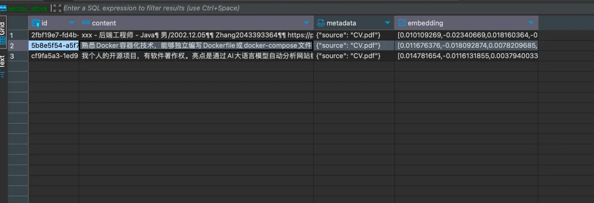
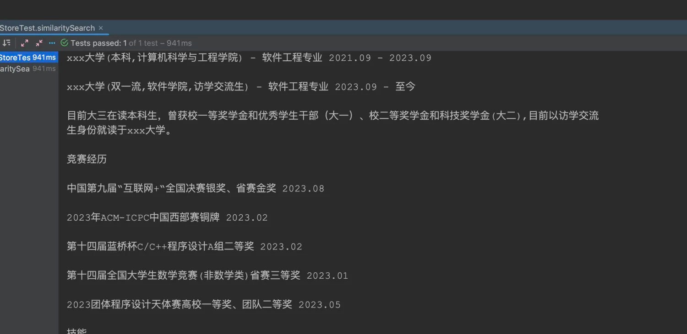

# 嵌入API结合向量数据库

&emsp;在上篇中，我们介绍了RAG的实现原理：

- 文本分割成一组文本；
- 一组文本调用嵌入模型获得一组向量并存储到向量数据库中；
- 提问时，在向量数据库执行相似性搜索获得与问题相关的一组文本；
- 将这组文本和问题一并发给AI

&emsp;其中，文本向量化我们可以通过`EmbeddingClient`接口调用嵌入模型实现，那对于向量数据库的存储和检索我们该怎么实现呢？对于这点，Spring AI也为我们准备好了。

## 3.1 Vector Database

&emsp;Spring AI为我们提供了对向量数据库操作的接口：`VectorStore`，该接口定义了对向量数据库的增、删、查的操作，方便我们快速地对向量数据库进行操作。目前Spring AI已经支持多种向量数据库的VectorStore实现：`AzureVectorStore`、`ChromaVectorStore`、`MilvusVectorStore`、`PgVectorStore`等等。



&emsp;这里将使用PGVector向量数据库。

## 3.2 PGVector安装

- 项目地址：[https://github.com/pgvector/pgvector](https://github.com/pgvector/pgvector)

&emsp;这里使用Docker快速部署PGVector，`docker-compose.yml`文件如下：

```yaml
version: '3.7'
services:
  postgres:
    image: ankane/pgvector:v0.5.0
    restart: always
    environment:
      - POSTGRES_USER=postgres
      - POSTGRES_PASSWORD=postgres
      - POSTGRES_DB=vector_store
      - PGPASSWORD=postgres
    logging:
      options:
        max-size: 10m
        max-file: "3"
    ports:
      - '5432:5432'
    healthcheck:
      test: "pg_isready -U postgres -d vector_store"
      interval: 2s
      timeout: 20s
      retries: 10
```

## 3.3 依赖引入

&emsp;PG Vector的依赖如下：
```xml
<dependency>
	<groupId>org.springframework.ai</groupId>
	<artifactId>spring-ai-pgvector-store-spring-boot-starter</artifactId>
</dependency>
```

&emsp;对于文件分割功能，Spring AI为我们提供了两种工具：

- `spring-ai-pdf-document-reader`: 主要针对PDF文件的分割，支持以目录，页面进行分割；

```xml
<dependency>
			<groupId>org.springframework.ai</groupId>
			<artifactId>spring-ai-pdf-document-reader</artifactId>
		</dependency>
```

- `spring-ai-tika-document-reader`: 对Apache tika工具的封装，支持各种文本文件的分割，包括：PDF、doc、excel、txt、md等等。详见：[https://tika.apache.org/](https://tika.apache.org/)

```xml
        <dependency>
            <groupId>org.springframework.ai</groupId>
            <artifactId>spring-ai-tika-document-reader</artifactId>
        </dependency>
```

## 3.4 配置信息

&emsp;在添加完上述依赖后，我们除了配置OpenAI的Key和URL外，还需要配置PgVector的连接信息。pgvector是PostgreSQL的扩展，因此它的连接配置和PostgreSQL无异。

```yaml
server:
  port: 8831

spring:

  ai:
    openai:
      api-key: sk-W9kYeExxxxxxxxxxxxxxB96fAd460353Dc7a
      base-url: https://api.mnzdna.xyz
  datasource:
    username: postgres
    password: postgres
    url: jdbc:postgresql://localhost/vector_store
```
## 3.5 文件向量化与存储

&emsp;和其它的接口一样，当Spring 启动时，会有一个`VectorStore`Bean注入进来，这里我们使用的是pgvector，对应`VectorStore`的实现类就是`PgVectorStore`。



&emsp;在VectorStore定义的接口时，我们操作的对象（实体、表）是`Document`.Document中包含ID、文本、文本的元数据、向量值。




&emsp;我们可以使用Spring AI为我们提供的文本分割工具，将大文本分割为一组`Document`，再将这组Document存储到向量数据库中。

&emsp;而在执行存储时，`VectorStore`会自动调用`EmbeddingClient`获取Document中文本的向量进行存储。

&emsp;而在执行相似性搜索时，也会自动调用`EmbeddingClient`获取输入文本的向量数据，然后根据向量数据在向量数据库中进行检索并返回一组相似的Document。

&emsp;下面就演示下对于一篇PDF文件的操作：

- 将PDF文件分割为一组Document；
- 将这组Document存储到向量数据库中；
- 执行相似性搜索，获取一组Document

### 3.5.1 注入文本分割器

&emsp;创建一个配置类，引入`TokenTextSplitter`,TokenTextSplitter可以将一段超长文本以Token数进行分割。

```java
package com.ningning0111.config;

import org.springframework.ai.document.DocumentTransformer;
import org.springframework.ai.transformer.splitter.TokenTextSplitter;
import org.springframework.context.annotation.Bean;
import org.springframework.context.annotation.Configuration;

@Configuration
public class ApplicationConfig {

    // 文本分割器
    @Bean
    public DocumentTransformer documentTransformer() {
        return new TokenTextSplitter();
    }
}

```

### 3.5.2 创建文件分割器

&emsp;`TikaDocumentReader`可以将文本文件转换为一组`Document`,在创建该对象时，需要指定文件的资源`Resource`。

```java
package com.ningning0111;

import org.junit.jupiter.api.Test;
import org.springframework.ai.document.Document;
import org.springframework.ai.document.DocumentTransformer;
import org.springframework.ai.reader.tika.TikaDocumentReader;
import org.springframework.ai.vectorstore.VectorStore;
import org.springframework.beans.factory.annotation.Autowired;
import org.springframework.beans.factory.annotation.Value;
import org.springframework.boot.test.context.SpringBootTest;
import org.springframework.core.io.Resource;

import java.util.List;

@SpringBootTest
public class VectorStoreTest {
    @Autowired
    private DocumentTransformer tokenTextSplitter;
    @Autowired
    private VectorStore vectorStore;
    @Value("classpath:CV.pdf")
    private Resource resource;
    @Test
    public void test1() {
        TikaDocumentReader tikaDocumentReader = new TikaDocumentReader(resource);
        List<Document> documents = tikaDocumentReader.get();
    }
}

```

### 3.5.3 文件向量化存储

&emsp;在通过`TikaDocumentReader`获取到一组Document后，还需要将这组Document使用`TokenTextSplitter`进行更深度的文本分割，获得到更加细化的Document,然后通过VectorStore将这组Document存储到向量数据库中去了。

```java
package com.ningning0111;

import org.junit.jupiter.api.Test;
import org.springframework.ai.document.Document;
import org.springframework.ai.document.DocumentTransformer;
import org.springframework.ai.reader.tika.TikaDocumentReader;
import org.springframework.ai.vectorstore.VectorStore;
import org.springframework.beans.factory.annotation.Autowired;
import org.springframework.beans.factory.annotation.Value;
import org.springframework.boot.test.context.SpringBootTest;
import org.springframework.core.io.Resource;

import java.util.List;

@SpringBootTest
public class VectorStoreTest {
    @Autowired
    private DocumentTransformer tokenTextSplitter;
    @Autowired
    private VectorStore vectorStore;

    @Value("classpath:CV.pdf")
    private Resource resource;


    @Test
    public void addDocumentToVectorDB() {
        TikaDocumentReader tikaDocumentReader = new TikaDocumentReader(resource);
        // 将文件中的文本分割为多组Document
        List<Document> fileDocuments = tikaDocumentReader.get();
        // 基于Token将多组Document进行更细化的分割
        List<Document> documents = tokenTextSplitter.apply(fileDocuments);
        // 存储到向量数据库中
        vectorStore.accept(documents);
    }
}

```

执行结果：




### 3.5.4 相似性搜索

&emsp;下面演示的是针对向量数据库执行的相似性搜索。

```java
    @Test
    public void similaritySearch() {
        List<Document> documents = vectorStore.similaritySearch("竞赛经历");
        // 获取每个Document里的content
        List<String> collect = documents.stream().map(Document::getContent).toList();
        collect.forEach(e->{
            System.out.println("-------");
            System.out.println(e);
        });
    }
```



&emsp;在与AI对话前，我们可以通过提示词等，将这些数据一并发送给AI，这样AI就可以根据这些数据进行回复了。
