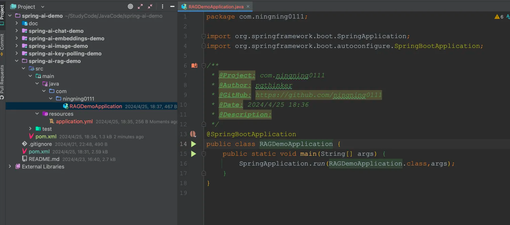
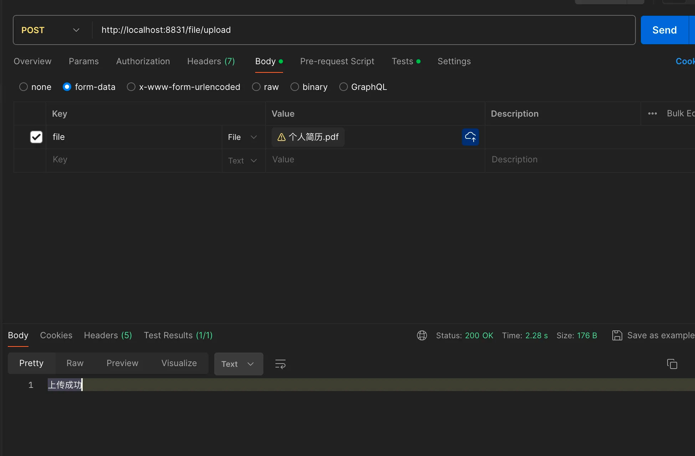
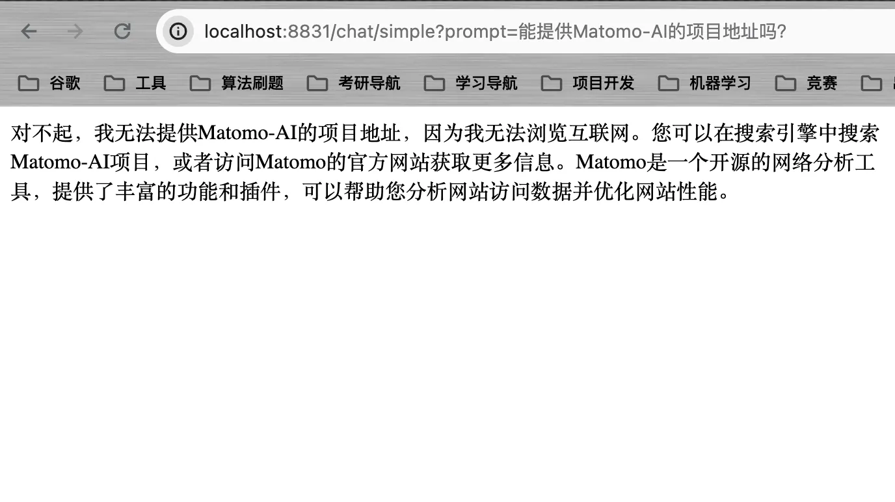
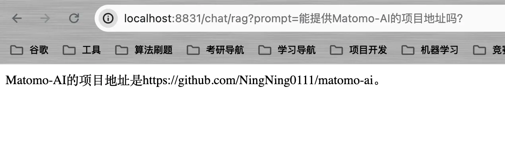
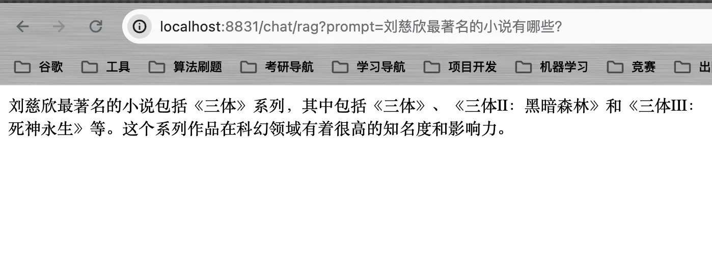
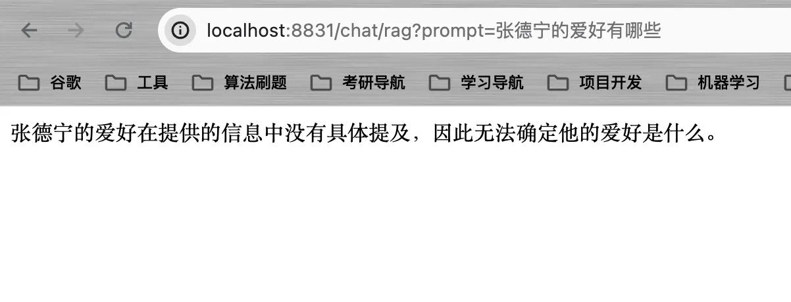

# RAG实战

&emsp;在上篇中，我们已经详细介绍了Spring AI 如何实现文件分割、如何实现文本分割以及如何对向量数据库进行操作，本篇就基于上篇提到的内容，简单实现一个采用了RAG技术的对话接口。

## 4.1 创建模块引入依赖

&emsp;这里创建`spring-ai-rag-demo`模块，并在`pom.xml`文件中加入下面的依赖：

```java
        <dependency>
            <groupId>org.springframework.ai</groupId>
            <artifactId>spring-ai-openai-spring-boot-starter</artifactId>
        </dependency>
        <dependency>
            <groupId>org.springframework.ai</groupId>
            <artifactId>spring-ai-pgvector-store-spring-boot-starter</artifactId>
        </dependency>
        <dependency>
            <groupId>org.springframework.ai</groupId>
            <artifactId>spring-ai-tika-document-reader</artifactId>
        </dependency>
```

## 4.2 创建配置文件

```yaml
server:
  port: 8831

spring:

  ai:
    openai:
      api-key: sk-W9kYeE3JfWMxxxxxxxxB96fAd460353Dc7a
      base-url: https://api.mnzdna.xyz
  datasource:
    username: postgres
    password: postgres
    url: jdbc:postgresql://localhost/demo
```



## 4.3 创建配置类注入必要依赖

&emsp;创建一个配置类，注入文本分割器`TokenTextSplitter`。

```java
package com.ningning0111.config;

import org.springframework.ai.document.DocumentTransformer;
import org.springframework.ai.transformer.splitter.TokenTextSplitter;
import org.springframework.context.annotation.Bean;
import org.springframework.context.annotation.Configuration;

@Configuration
public class ApplicationConfig {
    @Bean
    public DocumentTransformer documentTransformer() {
        return new TokenTextSplitter();
    }
}

```

> 如果需要手动注入PgVectorStore,还需将PgVector的自动配置类排除。

## 4.3 向量数据库文件操作Service

&emsp;`FileStoreService`的功能是将文件向量化并存储到向量数据库中。

```java
package com.ningning0111.service;

import org.springframework.ai.document.Document;
import org.springframework.ai.document.DocumentTransformer;
import org.springframework.ai.reader.tika.TikaDocumentReader;
import org.springframework.ai.vectorstore.VectorStore;
import org.springframework.core.io.Resource;
import org.springframework.stereotype.Service;
import org.springframework.web.multipart.MultipartFile;

import java.util.List;

@Service
public class FileStoreService {
    private final VectorStore vectorStore;
    private final DocumentTransformer documentTransformer;

    public FileStoreService(VectorStore vectorStore, DocumentTransformer documentTransformer) {
        this.vectorStore = vectorStore;
        this.documentTransformer = documentTransformer;
    }

    public Object saveFile(MultipartFile file){
        try {
            Resource resource = file.getResource();
            TikaDocumentReader tikaDocumentReader = new TikaDocumentReader(resource);
            List<Document> fileDocuments = tikaDocumentReader.get();
            List<Document> documents = documentTransformer.apply(fileDocuments);
            vectorStore.accept(documents);
            return "上传成功";
        }catch (Exception e){
            return e.getCause();
        }
    }
}

```

## 4.4 创建文件上传接口

&emsp;创建一个`FileStoreController`，定义文件上传的接口。

```java
package com.ningning0111.controller;

import com.ningning0111.service.FileStoreService;
import org.springframework.web.bind.annotation.PostMapping;
import org.springframework.web.bind.annotation.RequestMapping;
import org.springframework.web.bind.annotation.RestController;
import org.springframework.web.multipart.MultipartFile;


@RequestMapping("/file")
@RestController
public class FileStoreController {
    private final FileStoreService fileStoreService;

    public FileStoreController(FileStoreService fileStoreService) {
        this.fileStoreService = fileStoreService;
    }

    @PostMapping("/upload")
    public Object uploadFile(MultipartFile file){
        return fileStoreService.saveFile(file);
    }
}

```



## 4.5 创建RAG提示词

&emsp;在创建对话接口前，我们需要创建一个提示词来让AI可以根据查找的内容进行回复。
提示词如下：

```
Context information is below.
---------------------
{context}
---------------------
Given the context information and not prior knowledge, answer the question.
You need to respond with content in context first, and then respond with your own database. When the given context doesn't help you answer the question, just say "I don't know."

Question: {question}
Answer:

```

## 4.6 创建对话接口

&emsp;为了体现出RAG的优势，这里将分别创建：`基于RAG实现的对话接口`和`普通的对话接口`。

```java
package com.ningning0111.controller;

import org.springframework.ai.chat.ChatClient;
import org.springframework.ai.chat.ChatResponse;
import org.springframework.ai.chat.messages.AssistantMessage;
import org.springframework.ai.chat.prompt.Prompt;
import org.springframework.ai.chat.prompt.SystemPromptTemplate;
import org.springframework.ai.document.Document;
import org.springframework.ai.vectorstore.VectorStore;
import org.springframework.beans.factory.annotation.Value;
import org.springframework.core.io.Resource;
import org.springframework.web.bind.annotation.GetMapping;
import org.springframework.web.bind.annotation.RequestMapping;
import org.springframework.web.bind.annotation.RestController;

import java.util.List;
import java.util.Map;

@RestController
@RequestMapping("/chat")
public class RAGChatController {
    
    @Value("classpath:rag.st")
    private Resource promptResource;

    private final ChatClient chatClient;
    
    private final VectorStore vectorStore;

    public RAGChatController(ChatClient chatClient, VectorStore vectorStore) {
        this.chatClient = chatClient;
        this.vectorStore = vectorStore;
    }

    @GetMapping("/simple")
    public String simpleChat(String prompt) {
        return chatClient.call(prompt);
    }

    @GetMapping("/rag")
    public String ragChat(String prompt){
        // 从向量数据库中搜索相似文档
        List<Document> documents = vectorStore.similaritySearch(prompt);
        // 获取documents里的content
        List<String> context = documents.stream().map(Document::getContent).toList();
        // 创建系统提示词
        SystemPromptTemplate promptTemplate = new SystemPromptTemplate(promptResource);
        // 填充数据
        Prompt p = promptTemplate.create(Map.of("context", context, "question", prompt));

        ChatResponse response = chatClient.call(p);
        AssistantMessage aiMessage = response.getResult().getOutput();
        return aiMessage.getContent();
    }

}

```
## 4.7 对话测试：

### 4.7.1 简单对话



### 4.7.2 RAG对话

&emsp;当向量数据库存在相关数据时：


&emsp;当向量数据库不存在相关数据，但AI自身的数据库存在相关数据时：



&emsp;当向量数据库不存在相关数据且AI自身的数据库也不存在相关数据时：


